# Программная модель BB84-like CV-QKD: постановка задачи, математический аппарат, архитектура, эксперименты и результаты

> Документ заполняет каркас разделов 2–7 на основе программной реализации
> [QWEticker/NIR](https://github.com/QWEticker/NIR). Терминология, трёхуровневая
> концептуальная модель и стиль изложения согласованы с отчётом по НИР
> «Моделирование квантового распределения ключей по BB84-подобному протоколу с
> непрерывными переменными». Все формулы соответствуют исходному коду
> (`security_analyzer.cpp`, `parameter_estimator.cpp`, `quantum_channel.cpp`,
> `heterodyne_detector.cpp`, модели атак). Числовые результаты получены прогоном
> симулятора и хранятся в `results/study/*.csv`.
>
> **Фокус по атакам** (по согласованию): рассматриваются две практические атаки,
> специфичные для CV-QKD — **насыщение детектора** и **манипуляция локальным
> осциллятором (LO)**. Остальные модели (перехват-пересылка, коллективная) в коде
> присутствуют, но в данном документе используются лишь как контекст.

Все шумовые величины приведены в единицах дробового шума (SNU, shot-noise units),
в которых дисперсия вакуума равна 1.

---

## 2 ПОСТАНОВКА ЗАДАЧИ И ТРЕБОВАНИЯ К ПРОГРАММНОЙ МОДЕЛИ

### 2.1 Формализация цели и задач моделирования

**Цель** — построить программную модель BB84-подобного протокола квантового
распределения ключей с непрерывными переменными (BB84-like CV-QKD) на когерентных
состояниях с QPSK-модуляцией и гетеродинным детектированием, которая позволяет
количественно оценивать защищённость протокола и её деградацию под действием
практических атак на приёмную часть, а также исследовать восстановление
защищённости подстройкой параметров системы.

Формально модель реализует отображение
> **M = F(θ, A)**,

где `θ` — вектор параметров системы и канала (амплитуда модуляции `α`, длина линии
`L` и трансмиссивность `T`, избыточный шум `ξ`, квантовая эффективность `η`,
электронный шум `v_el`, порог насыщения `sat`, эффективность согласования `β`,
число импульсов `N`, seed); `A` — конфигурация атаки (тип и её параметры);
`M = {Î_AB, χ̂_BE, K_asymp, K_β, secure, T̂, ξ̂}` — вектор выходных метрик.

Исследование разбито на **три этапа** (рис. 2.1):
1. **Базовый режим** — при оптимальных параметрах из литературы (Huang et al.,
   npj QI 2016; Grosshans–Grangier, PRL 2002) выполняется sweep по дистанции и
   фиксируется зависимость метрик `M(L)` без атак.
2. **Атаки** — при тех же параметрах подключаются насыщение и манипуляция LO;
   фиксируется деградация `M(L)`.
3. **Восстановление** — перебором параметров `θ` (`α`, `β`, калибровка) ищется
   режим `argmax K_β(L | θ, A)`, при котором защищённость восстанавливается.

**Задачи моделирования:**
- реализовать полный конвейер протокола: источник → канал → гетеродин →
  дискретизация → оценка параметров → расчёт `I_AB`, `χ_BE`, `K_β`;
- обеспечить подключаемую модель атак на приёмную часть;
- реализовать систему критериев оценки защищённости (раздел 2.4);
- обеспечить воспроизводимые серии экспериментов с журналированием в CSV;
- автоматизировать построение графиков для анализа зависимостей метрик.

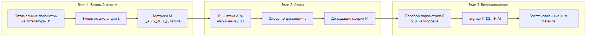
**Рисунок 2.1** — Концептуальная схема постановки задачи: три этапа исследования
(базовый режим → атаки → восстановление).

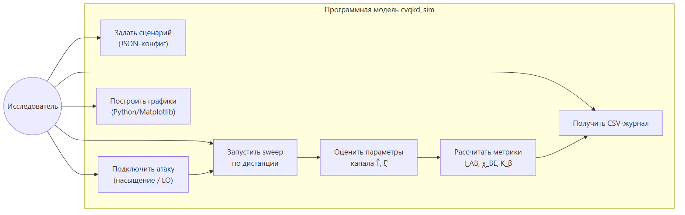
**Рисунок 2.2** — Диаграмма вариантов использования (use-case) программной модели
с точки зрения исследователя.

### 2.2 Функциональные и нефункциональные требования к модели BB84-like CV-QKD

**Функциональные требования (ФТ).** Система должна моделировать полный цикл
BB84-подобного протокола с непрерывными переменными:

| № | Требование | Реализация в коде |
|---|---|---|
| ФТ-1 | Генерация Алисой случайных битовых пар и отображение в 4 когерентных состояния `α·iᵏ` | `QPSKModulator::generate` |
| ФТ-2 | Модуляция с заданной амплитудой `α`, дисперсия модуляции `V_A = α²` | `QPSKModulator::modulation_variance` |
| ФТ-3 | Передача через квантовый канал с параметрами `T` и `ξ` | `QuantumChannel::transmit` |
| ФТ-4 | Гетеродинное измерение Бобом, получение пар `(X, P)` | `HeterodyneDetector::measure` |
| ФТ-5 | Дискретизация измерений по фазовому углу на 4 сектора | `PhaseDiscretizer` |
| ФТ-6 | Оценка параметров канала `T̂`, `ξ̂` и доверительных интервалов | `ParameterEstimator::estimate` |
| ФТ-7 | Расчёт `I_AB`, границы Холево `χ_BE` и секретной скорости `K_β` | `SecurityAnalyzer::compute` |
| ФТ-8 | Информационное согласование в режиме обратного согласования (`β·I_AB`) | `Reconciliation::run` |
| ФТ-9 | Подключаемые модели атак (насыщение, LO) | `IAttack`, `IAttackModel` |
| ФТ-10 | Параметризация через конфигурационные файлы JSON | `ProtocolConfig`, `ExperimentConfig::from_json_file` |
| ФТ-11 | Сбор статистики и экспорт в CSV | `StatisticsLogger` |

**Нефункциональные требования** вынесены в раздел 2.5.

### 2.3 Требования к архитектуре модуля моделирования атак

Модуль атак должен удовлетворять следующим требованиям:
- **Единый интерфейс.** Каждая атака реализует общий контракт, чтобы её можно было
  подключать без изменения ядра протокола (паттерн «Стратегия»). В коде это две
  параллельные иерархии:
  - `IAttack` — *симуляционная* ветвь: метод `apply(Measurement& m)` искажает
    отсчёты Боба на уровне выборки (влияет на оценку `T̂`, `ξ̂`);
  - `IAttackModel` — *аналитическая* ветвь: метод
    `computeEffect(T, V_A, ξ_in) → AttackResult` возвращает добавочный избыточный
    шум `ξ_add`, который входит в расчёт `χ_BE`.
- **Расширяемость.** Добавление новой атаки = новый класс-наследник без
  модификации `ExperimentRunner`.
- **Композиция.** Несколько атак подключаются одновременно; их вклады в `ξ_eff`
  суммируются.
- **Соответствие физике.** Параметры атаки имеют ясный физический смысл (порог
  насыщения `sat`, усиление `gain`, масштаб LO `scale`).

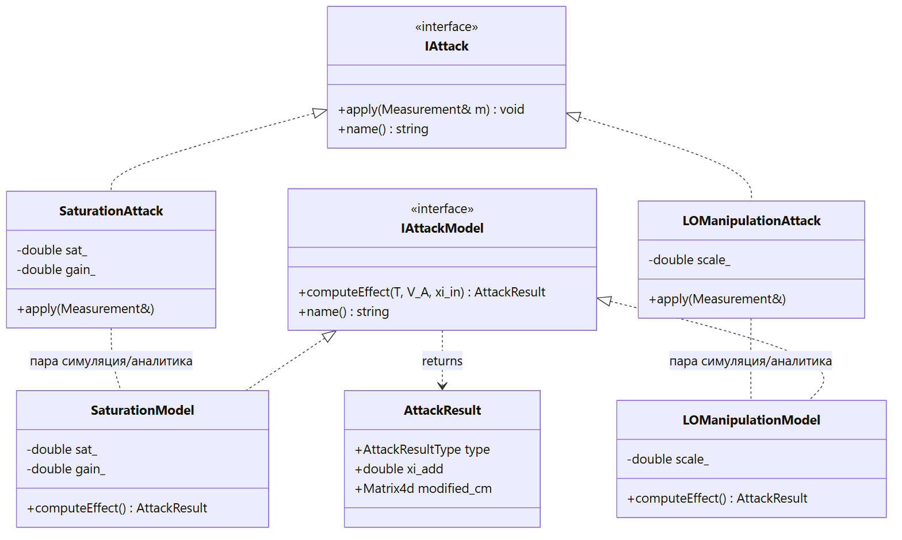
**Рисунок 2.3** — Диаграмма классов модуля атак: интерфейсы `IAttack`/`IAttackModel`
и их реализации для насыщения и манипуляции LO (паттерн «Стратегия»).

### 2.4 Требования к системе критериев оценки

Система критериев должна вычислять следующую цепочку величин (рис. 2.4):
1. **Сырые измерения** Боба `(X, P)`.
2. **Оценки канала**: `T̂`, `ξ̂`, эффективный шум `ξ_eff`, доверительные интервалы
   (95 %).
3. **Информационные величины**: взаимная информация `I_AB` и граница Холево
   `χ_BE` (информация, доступная Еве).
4. **Ключевые скорости**: асимптотическая `K_asymp = I_AB − χ_BE` и практическая
   `K_β = max(0, β·I_AB − χ_BE)`.
5. **Признак защищённости** `secure ≡ (K_β > 0)` и производная **дальность
   секретности** `L_max` — максимальная длина линии, при которой `K_β > 0`.

Требования: метрики должны вычисляться для каждой точки `(L, сценарий)`,
сохраняться в журнал и быть пригодны для построения зависимостей от дистанции и
от параметров.

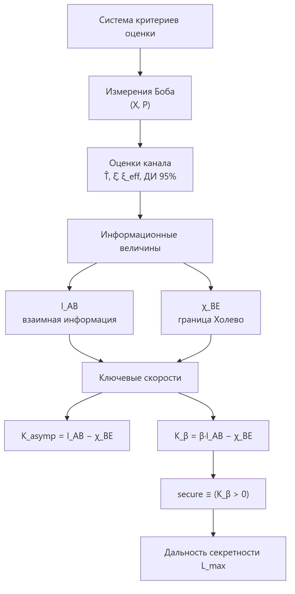
**Рисунок 2.4** — Иерархия системы критериев оценки: от сырых измерений к признаку
защищённости и дальности.

### 2.5 Нефункциональные требования

| Категория | Требование |
|---|---|
| **Производительность** | Прогон `N = 6·10⁵…10⁶` импульсов на точку за секунды на стандартном ПК; векторизованные операции (Eigen). |
| **Масштабируемость/расширяемость** | Модульная структура; замена моделей канала, согласования, атак без перестройки ядра; единый интерфейс запуска. |
| **Кроссплатформенность** | C++17, сборка через CMake; отсутствие проприетарных зависимостей; собрано под Windows (MinGW-w64) и Linux/GCC. |
| **Воспроизводимость** | Детерминированный ГПСЧ с фиксируемым `seed`; полный набор параметров и метрик в CSV/JSON-логах. |
| **Тестируемость** | Покрытие компонентов модульными тестами (GoogleTest), сверка с аналитической Mathcad-моделью предыдущей НИР. |

---

## 3 МАТЕМАТИЧЕСКИЙ АППАРАТ BB84-LIKE CV-QKD В РАМКАХ ПРОГРАММНОЙ РЕАЛИЗАЦИИ

### 3.1 Математическое описание источника и модуляции (QPSK когерентных состояний)

Алиса кодирует пару случайных битов в индекс `k ∈ {0,1,2,3}` и формирует одно из
четырёх когерентных состояний, равномерно расположенных по окружности в фазовом
пространстве:
> **a_k = α · iᵏ,  k = 0,1,2,3,**

то есть точки `(+α, 0)`, `(0, +α)`, `(−α, 0)`, `(0, −α)`. Амплитуда `α`
задаёт **дисперсию модуляции** (на обе квадратуры):
> **V_A = α²** (в SNU), а полная дисперсия моды Алисы `V = V_A + 1`.

Чем больше `α`, тем «различимее» состояния и тем больше взаимная информация на
символ, однако усиление сигнала почти одинаково помогает и Бобу, и Еве (см. 3.6).
В коде модуляция реализована классом `QPSKModulator` (`generate(N)` возвращает
ключи `k` и комплексные амплитуды; `modulation_variance()` = `α²`).

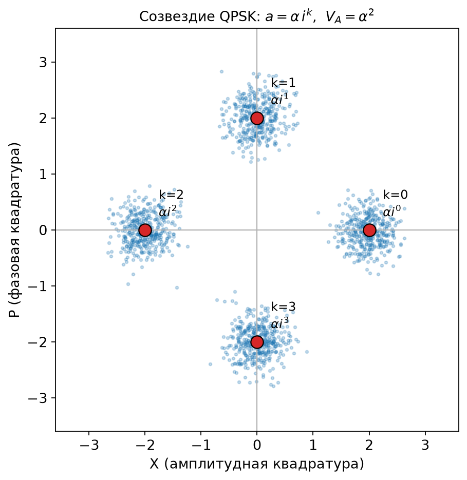
**Рисунок 3.1** — Созвездие QPSK когерентных состояний `a = α·iᵏ`; облака —
квантовая/канальная неопределённость, красные точки — идеальные положения.

### 3.2 Модель квантового канала с трансмиссивностью T и избыточным шумом ξ

Оптоволоконная линия моделируется как линейный канал с затуханием и аддитивным
гауссовым шумом. Трансмиссивность для волокна с погонными потерями `0.2 дБ/км`:
> **T = 10^(−0.2·L/10)**, `L` — длина линии в км.

Преобразование амплитуды Алисы в сигнал на входе Боба:
> **b = √T · a + n,  n ~ CN(0, T·ξ)** (дисперсия `T·ξ/2` на каждую квадратуру),

где `ξ` — избыточный шум сверх дробового (ключевой параметр безопасности).
Реализация — `QuantumChannel::transmit` (масштабирование на `√T`, добавление
гауссова шума с дисперсией, пропорциональной `T·ξ`). При фиксированной модуляции
существует критический уровень `ξ`, выше которого `K_β` обращается в ноль.

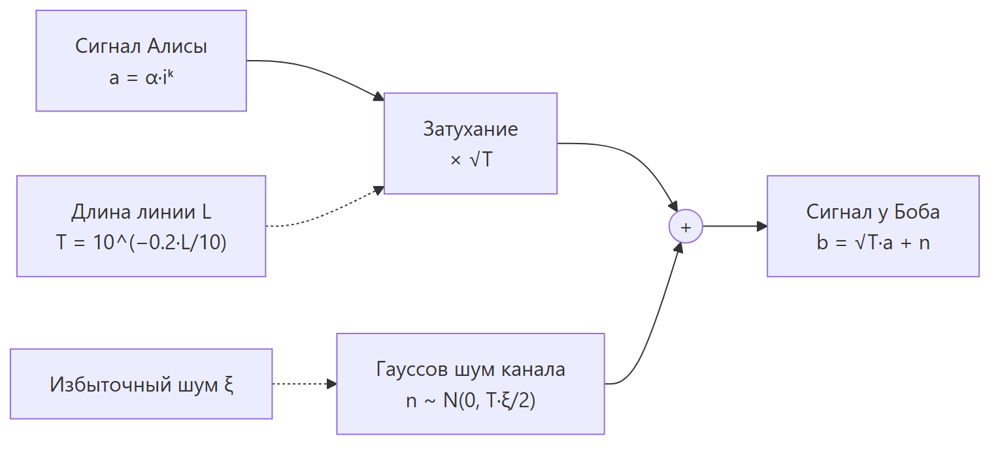
**Рисунок 3.2** — Модель квантового канала: затухание `×√T` и инжекция гауссова
шума с дисперсией `T·ξ/2`.

### 3.3 Модель гетеродинного измерения и шумов приёмника

Боб использует **гетеродинное** детектирование — одновременное измерение обеих
квадратур `X` и `P` (сигнал делится на светоделителе 50/50, две гомодинные ветви).
Квантовая эффективность детектора `η` и электронный шум `v_el` дают:
> **X = √η · Re(b) + ν_x,  P = √η · Im(b) + ν_p,**

с дисперсией детекторного шума `σ_det² = (1 + v_el)/η`. Совокупный шум гетеродина,
приведённый ко входу:
> **χ_het = (2 − η + 2·v_el) / η.**

Гетеродин вносит дополнительную единицу вакуумного шума (отсюда «2» в числителе) —
плата за одновременное измерение двух квадратур. Реализация —
`HeterodyneDetector::measure` и `detector_noise_variance()`.

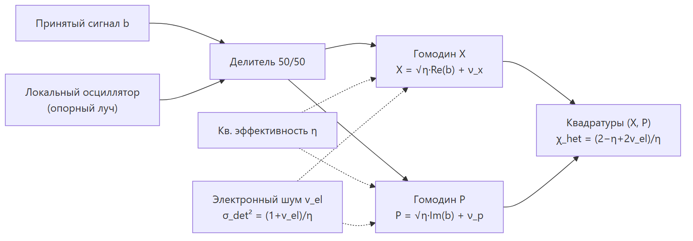
**Рисунок 3.3** — Схема гетеродинного приёмника и формирование шума `χ_het`.

### 3.4 Процедура дискретизации по фазовому углу

Для перехода от непрерывных отсчётов к дискретным символам вычисляется фазовый
угол `φ = atan2(P, X)` и определяется номер сектора:
> **k̂ = ⌊(φ + π/4) / (π/2)⌋ mod 4.**

Комплексная плоскость делится на 4 сектора по 90°, центрированных на положениях
созвездия; отсчёт относится к ближайшему по фазе состоянию. Реализация —
`PhaseDiscretizer`. Дискретизация используется для оценки ошибок символа и как
мост между непрерывными измерениями и «битовой» логикой BB84.

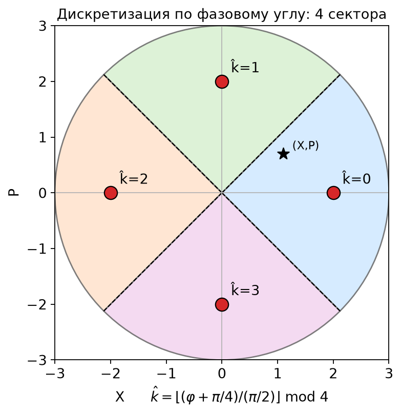
**Рисунок 3.4** — Дискретизация по фазовому углу: разбиение на 4 сектора и правило
отнесения измерения `(X,P)` к сектору `k̂`.

### 3.5 Оценка параметров канала (оценка T̂, ξ̂ и доверительных интервалов)

По парам «переданное–принятое» `(x_A, y_B)` методом наименьших квадратов
оценивается линейная модель `y_B = √(η·T̂)·x_A + шум`. Из наклона восстанавливается
`T̂`, из дисперсии остатков — избыточный шум:
> **ξ̂ = (σ²_resid − σ²_shot − σ²_det) / (η·T̂)** (с занулением отрицательных
> значений),

а также **доверительные интервалы 95 %** для `T̂` и `ξ̂` (полуширины
`T_ci_half`, `xi_ci_half`) по дисперсии оценок на конечной выборке. Реализация —
`ParameterEstimator::estimate`, возвращает структуру `ChannelEstimate`
(`T_hat`, `xi_hat`, `T_ci_half`, `xi_ci_half`, `sigma2_residual`, `n_samples`).

**Важная деталь модели атак.** Рассмотренные атаки масштабируют отсчёты Боба,
поэтому «сырая» оценка `ξ̂` зануляется (атака маскируется под потери, а не под
шум). Реально влияющий на безопасность шум вынесен в отдельную величину
`ξ_eff = ξ̂ + Σ ξ_add`, где `ξ_add` даёт аналитическая модель атаки (см. 3.8).

### 3.6 Расчёт взаимной информации и границы Холево

**Взаимная информация Алиса–Боб** (гетеродин, гауссова модуляция):
> **I_AB = log₂( (V + χ_tot) / (1 + χ_tot) ),**

где `V = V_A + 1`, суммарный приведённый шум
> **χ_line = (1 − T)/T + ξ,  χ_tot = χ_line + χ_het/T.**

**Граница Холево** `χ(B:E)` для когерентного CV-QKD с гетеродином, **обратным
согласованием** и доверенным детектором (Laudenbach et al. 2018; Fossier et al.
2009) считается через симплектические собственные значения ковариационной
матрицы `Γ_AB` и условной матрицы после измерения Боба:
> **χ_BE = G(ν₁) + G(ν₂) − G(ν₃) − G(ν₄),**
> **G(ν) = (x+1)·log₂(x+1) − x·log₂(x),  x = (ν−1)/2.**

Собственные значения `ν₁,ν₂` (моды A,B) и `ν₃,ν₄` (условная матрица) выражаются
через инварианты `A`, `B`, `C`, `D`, построенные из `V`, `T`, `χ_line`, `χ_het`
(реализация `SecurityAnalyzer::holevo_bound`, листинг ниже соответствует коду).

`χ_BE` имеет **немонотонную** зависимость от дистанции («горб»): на малых `L`
потери малы и Еве достаётся мало, на больших `L` сигнал тонет в шуме — максимум
утечки приходится на средние дистанции.

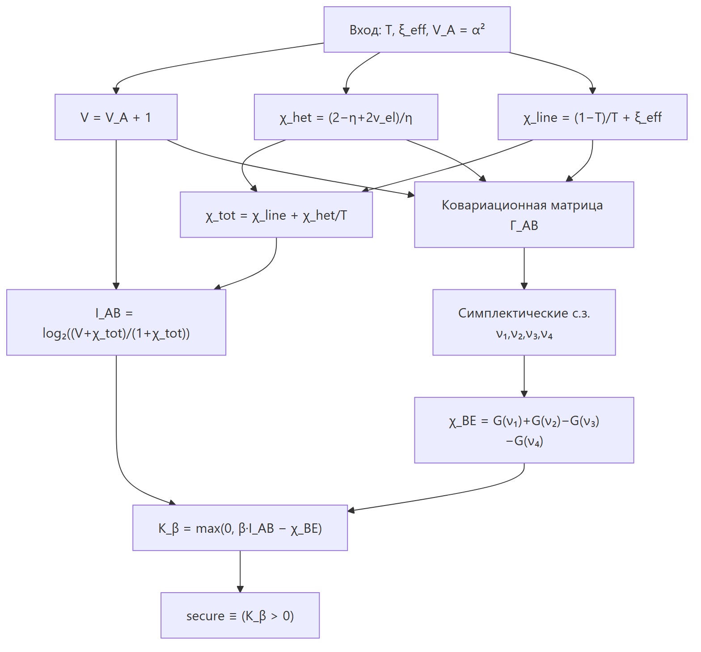
**Рисунок 3.5** — Поток данных расчёта безопасности: от `(T, ξ_eff, V_A)` к
`I_AB`, `χ_BE` и `K_β` через симплектические собственные значения.

### 3.7 Модель информационного согласования и усиления конфиденциальности

Реальные коды коррекции извлекают не всю взаимную информацию, а долю `β·I_AB`,
где `β ∈ (0, 1]` — **эффективность согласования** (в литературе `β ≈ 0.95`).
Практическая секретная скорость (обратное согласование):
> **K_β = max(0, β·I_AB − χ_BE).**

Учитывается конечно-ключевая поправка вида `Δ(n, ε) ≈ 6·√(ln(1/ε)/n)/ln2`
(модуль `FiniteKeyAnalyzer`). Усиление конфиденциальности (хеширование) укорачивает
ключ до безопасной длины. Реализация — `Reconciliation::run` (даёт `β·I_AB`),
итоговый `K_β` собирается в `SecurityAnalyzer::compute`.

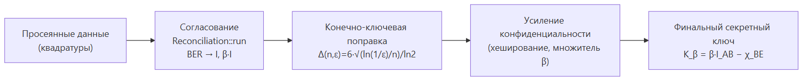
**Рисунок 3.6** — Конвейер постобработки: согласование → конечно-ключевая поправка
→ усиление конфиденциальности → секретный ключ.

### 3.8 Модель атак (в математических терминах)

**Атака насыщения детектора.** Ева/нелинейность приёмника обрезают отсчёты по
амплитуде. Симуляция (`SaturationAttack::apply`):
> **X ← clip(gain·X, ±sat),  P ← clip(gain·P, ±sat).**

Аналитический вклад в шум (`SaturationModel::computeEffect`):
> **ξ_add = max(0, (V − sat²)/V),  V = V_A + 1** (домножается на `|gain|`, если
> `gain ≠ 1`).

Смысл: клиппинг «срезает» дисперсию сигнала, что приёмник интерпретирует как рост
шума и снижение `T̂`.

**Атака манипуляции локальным осциллятором (LO).** Ева занижает/завышает амплитуду
опорного луча, что эквивалентно масштабированию измеренных квадратур. Симуляция
(`LOManipulationAttack::apply`):
> **X ← s·X,  P ← s·P.**

Аналитический вклад (`LOManipulationModel::computeEffect`):
> **ξ_add = max(0, 1/s² − 1).**

Смысл: занижение LO (`s < 1`) ломает калибровку дробового шума — приёмник
недооценивает уровень shot-noise, что эквивалентно инжекции избыточного шума.
Оба вклада суммируются в `ξ_eff` и через `χ_BE` снижают `K_β`.

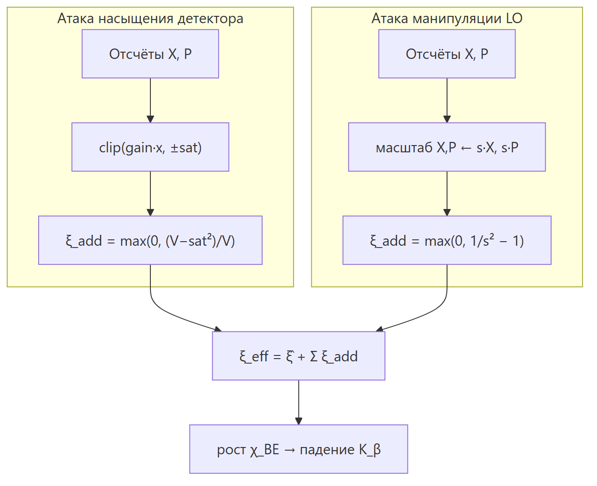
**Рисунок 3.7** — Математические модели атак: насыщение (клиппинг → `ξ_add`) и
манипуляция LO (масштаб → `ξ_add`); общий выход — рост `ξ_eff` и `χ_BE`.

---

## 4 АРХИТЕКТУРА И ПРОГРАММНАЯ РЕАЛИЗАЦИЯ МОДЕЛИ

### 4.1 Общая архитектура программного комплекса

Комплекс построен по трёхслойной схеме, согласованной с трёхуровневой
концептуальной моделью КРК (физический уровень / уровень протокола / уровень
постобработки):
- **Слой ядра (`cvqkd_lib`, C++17)** — физика и математика протокола: источник,
  канал, детектор, дискретизация, оценка параметров, анализ безопасности, атаки,
  решатель `ximax`.
- **Слой драйвера (C++)** — `main.cpp` + `ExperimentRunner`: читает JSON-конфиг,
  выполняет sweep, пишет CSV.
- **Слой исследований (Python)** — `run_study.py` (оркестрация серий) и
  `make_plots.py`/`make_extra_plots.py` (визуализация).

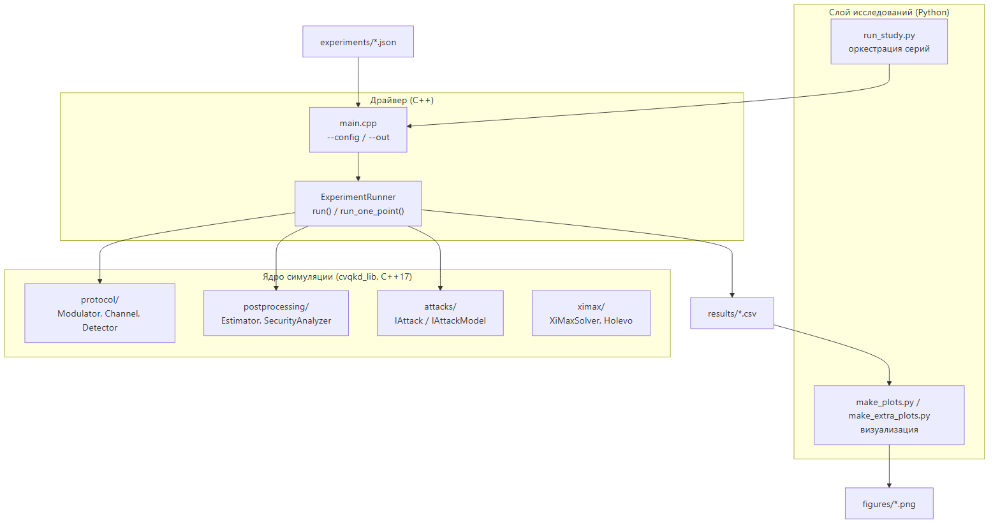
**Рисунок 4.1** — Трёхслойная архитектура: ядро C++ → драйвер → слой исследований
на Python; артефакты JSON → CSV → PNG.

Конвейер расчёта одной точки `run_one_point` и взаимодействие объектов:

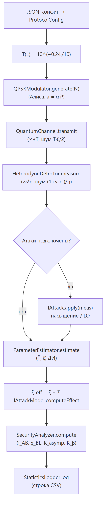
**Рисунок 4.2** — Блок-схема конвейера `run_one_point`: от JSON-конфига до строки
CSV (включая ветвление по наличию атак).

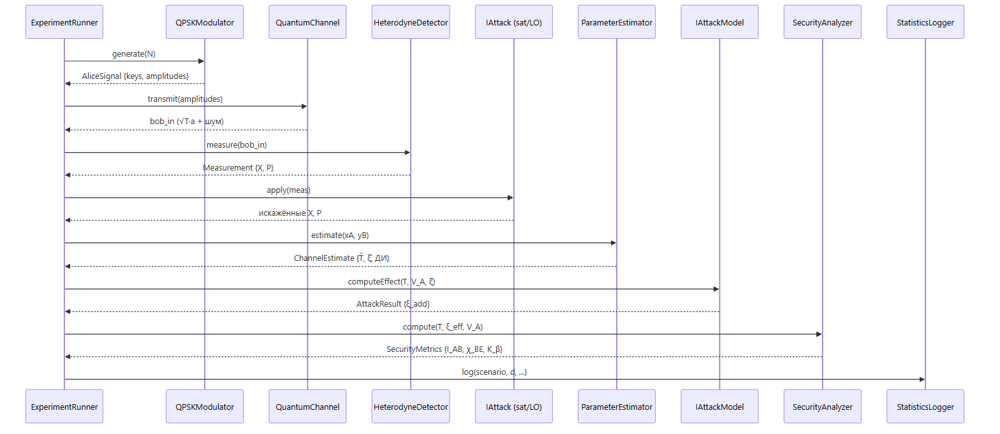
**Рисунок 4.3** — Sequence-диаграмма взаимодействия объектов при расчёте одной
точки эксперимента.

### 4.2 Организация программных модулей

| Модуль (каталог) | Назначение | Ключевые классы |
|---|---|---|
| генерация и модуляция | источник QPSK когерентных состояний | `QPSKModulator` |
| квантовый канал | затухание `√T` + шум `T·ξ` | `QuantumChannel` |
| измерение (гетеродин) | измерение `(X,P)`, шум приёмника | `HeterodyneDetector` |
| дискретизация и постобработка | секторизация по фазе | `PhaseDiscretizer`, `Reconciliation` |
| оценка параметров | `T̂`, `ξ̂`, ДИ | `ParameterEstimator` |
| расчёт безопасности | `I_AB`, `χ_BE`, `K_β` | `SecurityAnalyzer`, `ximax` |
| моделирование атак | насыщение, LO | `IAttack`/`IAttackModel` + реализации |
| сбор/хранение/визуализация | CSV-журнал, графики | `StatisticsLogger`, Python-скрипты |

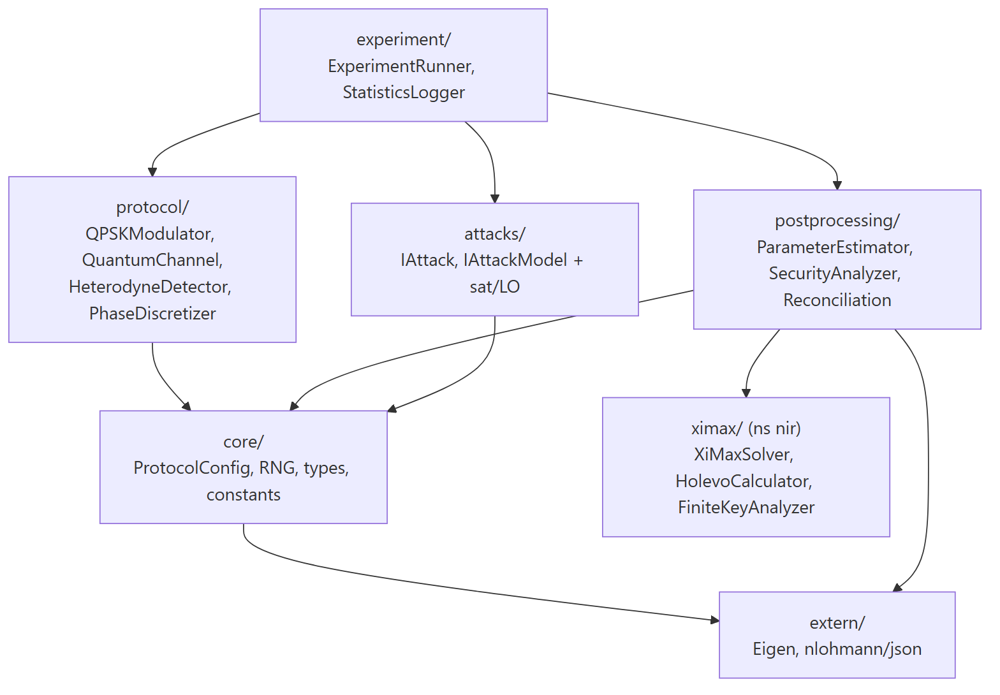
**Рисунок 4.4** — Диаграмма модулей (пакетов) и их зависимостей; `core`
предоставляет конфиг/типы/ГПСЧ, `ximax` — расчёт границы Холево.

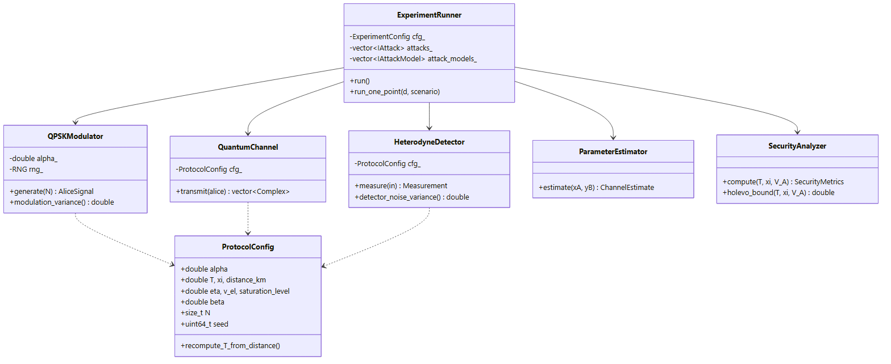
**Рисунок 4.5** — Диаграмма ключевых классов ядра и их связей с `ProtocolConfig`.

### 4.3 Используемые библиотеки и средства

- **Линейная алгебра** — [Eigen 3](https://eigen.tuxfamily.org) (header-only,
  в `extern/`): векторы/матрицы квадратур, симплектические вычисления.
- **JSON-конфигурация** — [nlohmann/json](https://github.com/nlohmann/json)
  (header-only): чтение `ProtocolConfig`/`ExperimentConfig`.
- **Генераторы случайных чисел** — стандартный `<random>` (Mersenne Twister
  `std::mt19937_64`) c фиксируемым `seed` (модуль `core/rng`), что обеспечивает
  воспроизводимость.
- **Модульное тестирование** — [GoogleTest 1.14.0](https://github.com/google/googletest)
  (подключается через `FetchContent`).
- **Визуализация** — Python 3 + [Matplotlib](https://matplotlib.org)
  (`make_plots.py`, `make_extra_plots.py`).
- **Сборка** — CMake ≥ 3.8, C++17, оптимизация `-O3`/`/O2`.

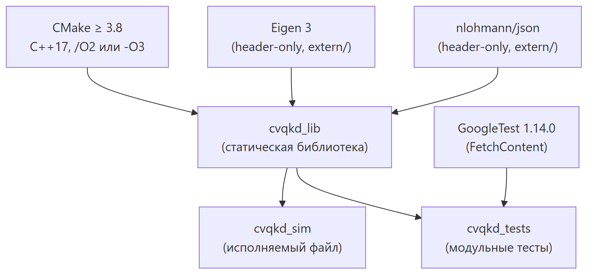
**Рисунок 4.6** — Стек библиотек и цели сборки CMake (`cvqkd_lib`, `cvqkd_sim`,
`cvqkd_tests`).

### 4.4 Выбор базовых структур и алгоритмов (в C++17)

- **Конфигурация** — POD-структуры `ProtocolConfig`/`ExperimentConfig` с
  десериализацией из JSON; метод `recompute_T_from_distance()` пересчитывает `T`
  по длине линии.
- **Сигналы и измерения** — типы на базе Eigen (`VectorXcd` для амплитуд,
  `Measurement{X, P}` как пара вещественных векторов), что даёт векторизованные
  операции над всей выборкой `N` без поэлементных циклов.
- **Полиморфизм атак** — абстрактные интерфейсы `IAttack`/`IAttackModel`
  (паттерн «Стратегия»); подключение по имени из конфигурации.
- **Оценка параметров** — наименьшие квадраты (наклон + дисперсия остатков) с
  расчётом доверительных интервалов.
- **Граница Холево** — замкнутые формулы через инварианты `A,B,C,D` и
  симплектические собственные значения (без численной диагонализации, что быстро
  и устойчиво).

### 4.5 Особенности реализации и оптимизации

- **Векторизация** через Eigen: канал, детектор и атаки применяются к векторам
  `X`, `P` целиком (`m.X *= scale`, `clamp` в цикле по индексам Eigen) — основная
  «горячая» обработка `N ~ 10⁶` идёт без накладных расходов на ООП-вызовы на
  элемент.
- **Аналитическая граница Холево** вместо стохастической оценки информации Евы:
  расчёт `χ_BE` по формулам выполняется за `O(1)` на точку, что позволяет дёшево
  делать sweep по дистанции и перебор параметров (этап 3).
- **Разделение симуляции и аналитики атак** (`IAttack` vs `IAttackModel`):
  выборочное искажение влияет на оценку `T̂`/`ξ̂`, а аналитический `ξ_add`
  корректно входит в `χ_BE` через `ξ_eff` — это исключает «самообман» оценщика,
  для которого атаки скрытны.
- **Память** — потоковая обработка по точкам sweep; пиковая память определяется
  размером выборки `N`, метрики агрегируются в строки CSV.
- **Детерминизм** — фиксированный `seed` обеспечивает побитово воспроизводимые
  серии.

### 4.6 Модульное тестирование и верификация (сравнение с Mathcad-моделью)

Компоненты покрыты модульными тестами на GoogleTest (`cvqkd_tests`): проверяются
модуляция (`V_A = α²`, корректность созвездия), статистика канала (`E[b]`,
дисперсии), шум гетеродина (`χ_het`), оценка параметров (восстановление заданных
`T`, `ξ` на больших `N`), монотонность `I_AB` и формула `χ_BE`, а также модели
атак (знак и величина `ξ_add`). Локально проходит 12/12 тестов.

**Верификация против Mathcad-модели** предыдущей НИР: при отключённых атаках и
тех же параметрах канала сравниваются (1) зависимость BER/`I_AB` от SNR/дистанции
и (2) предельная дальность секретности. Совпадение качественного поведения
(монотонный спад `I_AB`, «горб» `χ_BE`, дальность ~55–60 км при оптимальных
параметрах) подтверждает корректность переноса аналитической модели в код.

---

## 5 МОДЕЛИРОВАНИЕ АТАК И СЦЕНАРИЕВ ФУНКЦИОНИРОВАНИЯ

### 5.1 Описание сценариев атак

Рассматриваются две практические атаки на приёмную часть CV-QKD.

**Насыщение детектора** (`saturation`). Параметры:
- `saturation_level` (`sat`) — порог обрезания отсчётов (SNU);
- `gain` — предусиление перед обрезанием.

Режимы: при `sat ≫ V` детектор не клиппирует (базовый режим); при `sat² < V`
возникает добавочный шум `ξ_add = (V − sat²)/V`. В исследовании использовался
агрессивный режим, дающий `ξ_eff ≈ 0.2 SNU`.

**Манипуляция локальным осциллятором** (`lo`). Параметр:
- `scale` (`s`) — масштаб амплитуды LO (эквивалент масштабирования квадратур).

Режимы: `s = 1` — норма; `s < 1` (занижение LO) ломает калибровку дробового шума и
даёт `ξ_add = 1/s² − 1` (например `s = 0.85 → ξ_add ≈ 0.38 SNU`); `s > 1` —
завышение (в данном исследовании не опасно).

### 5.2 Интеграция модуля атак с основной моделью протокола

`ExperimentRunner` по имени атаки из конфигурации создаёт пару объектов:
симуляционный `IAttack` (искажает `Measurement` после детектора — влияет на
`ParameterEstimator`) и аналитический `IAttackModel` (даёт `ξ_add`). Итоговый
эффективный шум `ξ_eff = ξ̂ + Σ ξ_add` подаётся в `SecurityAnalyzer`. Такое
разделение исключает ситуацию, когда атака «прячется» от оценщика и при этом
ошибочно повышает оценку безопасности.

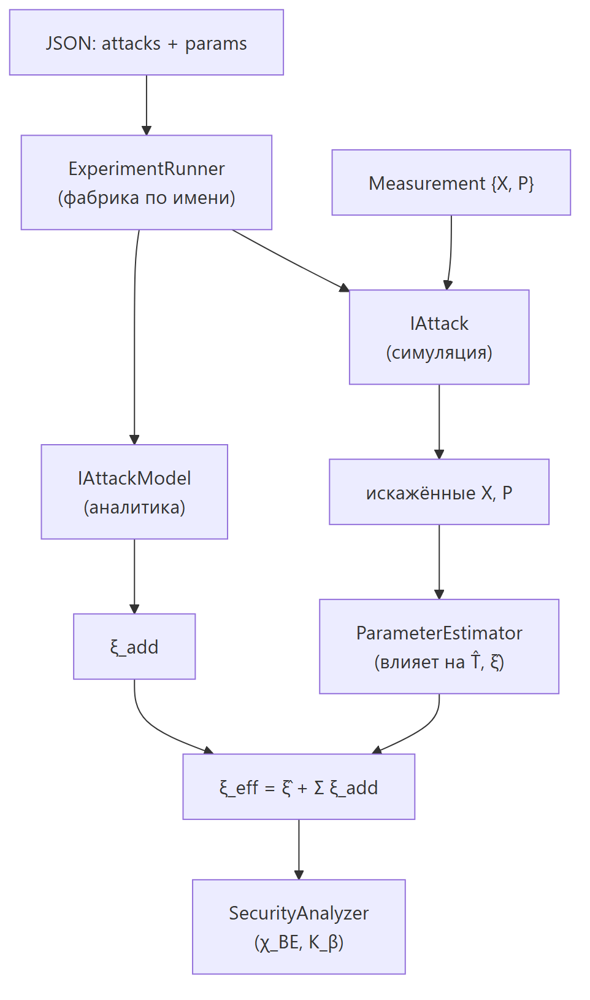
**Рисунок 5.1** — Интеграция модуля атак: симуляционная ветвь (`IAttack` → оценка
`T̂,ξ̂`) и аналитическая ветвь (`IAttackModel` → `ξ_add`), сходящиеся в `ξ_eff`.

### 5.3 Описание сценариев экспериментов без атак (базовый режим)

Базовый режим задаётся конфигом `experiments/optimal.json`: `α = 2.0` (`V_A = 4`),
`η = 0.6`, `v_el = 0.015`, `ξ = 0.01`, `β = 0.95`, `sat = 10⁹` (детектор не
клиппирует), `N = 6·10⁵`, потери `0.2 дБ/км`. Sweep по дистанции
`L ∈ {1,5,10,15,20,25,30,40,50,60,70,80}` км. Выход — `baseline.csv`.

### 5.4 Описание сценариев экспериментов при наличии атак (вариации параметров)

Те же параметры и тот же sweep, но с подключённой атакой:
- `attack_saturation.csv` — насыщение (`ξ_eff ≈ 0.2`);
- `attack_lo.csv` — манипуляция LO (`s = 0.85`, `ξ_eff ≈ 0.38`).

Для этапа восстановления — перебор `α ∈ [1,3]`, `β ∈ {0.95, 0.98}` и калибровки
(`sat`, `scale → 1.0`); результаты в `recovered_*.csv`, а одно-параметрические
срезы — в `sweep_*_{alpha,beta,saturation_level,scale}.csv`.

### 5.5 Формат журналирования и хранения результатов экспериментов

Результаты пишутся `StatisticsLogger` построчно в CSV; одна строка = одна точка
`(сценарий, дистанция)`. Базовый набор колонок:

```
distance_km, T_true, T_hat, xi_hat, xi_eff, I_AB, chi_BE, K_asymp, K_beta
```

В файлах восстановления добавляются колонки подобранных параметров
(`V_A, alpha, beta, saturation_level | scale`). Формат CSV выбран ради
переносимости и прямого чтения Python/Matplotlib; все прогоны детерминированы
по `seed`, поэтому воспроизводимы.

---

## 6 ПЛАН И МЕТОДИКА ВЫЧИСЛИТЕЛЬНЫХ ЭКСПЕРИМЕНТОВ

### 6.1 Спецификация параметров канала

| Параметр | Диапазон / значение | Примечание |
|---|---|---|
| Длина линии `L` | 1…80 км (12 точек) | sweep |
| Погонные потери | 0.2 дБ/км | стандартное волокно |
| Трансмиссивность `T` | `10^(−0.2·L/10)` | производная от `L` (1 км→0.955, 25 км→0.316, 60 км→0.063) |
| Избыточный шум `ξ` | 0.01 SNU (базовый) | критический порог исследуется |

### 6.2 Наборы параметров протокола

| Параметр | Значение(я) | Источник |
|---|---|---|
| Амплитуда `α` (`V_A=α²`) | 2.0 (базово), перебор 1…3 | Grosshans–Grangier 2002 |
| Эффективность детектора `η` | 0.6 | Huang et al. 2016 |
| Электронный шум `v_el` | 0.015 SNU | Huang et al. 2016 |
| Эффективность согласования `β` | 0.95 (базово), 0.98 | литература |
| Число импульсов `N` | 6·10⁵ | компромисс точность/время |
| Seed | 42 | воспроизводимость |

### 6.3 Наборы параметров атак

| Атака | Параметр | Значения |
|---|---|---|
| Насыщение | `sat` (порог), `gain` | базово 10⁹ (нет клиппинга); атака — `ξ_eff ≈ 0.2`; восстановление `sat = 4` |
| LO | `scale` `s` | базово 1.0; атака `s = 0.85`; восстановление `s → 1.0` (срез `0.97`) |

### 6.4 Методика проведения серий экспериментов

Серии оркеструются `run_study.py` в четыре стадии (рис. 6.1): (1) baseline,
(2) атаки, (3) восстановление перебором, (4) чувствительность по одному параметру
(на фиксированной дистанции `L = 25 км`). Для каждой точки фиксирован `N` и
`seed`; при необходимости статистической сходимости возможно усреднение по
`runs_per_point` повторов с разными seed. Этап 3 на каждой дистанции берёт лучший
`K_β` по соответствующему срезу параметров (верхняя огибающая).

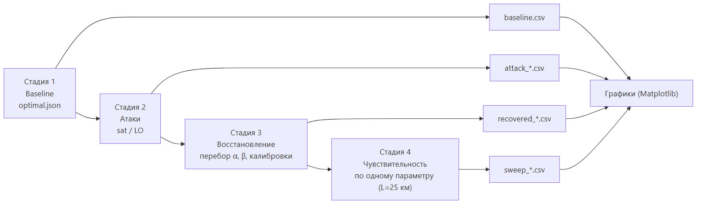
**Рисунок 6.1** — Методика серий: четыре стадии и порождаемые ими наборы данных
(CSV) и графики.

### 6.5 Вычисляемые показатели

- **Секретная скорость** `K_β` (бит/символ) и `K_asymp`; признак `secure`.
- **Взаимная информация** `I_AB`; **граница Холево** `χ_BE`.
- **Оценки канала** `T̂`, `ξ̂`, `ξ_eff` и доверительные интервалы.
- **Дальность секретности** `L_max` (где `K_β` обращается в ноль).
- Производные характеристики устойчивости (критический `ξ`, чувствительность к
  параметрам).

### 6.6 Представление результатов

Результаты представляются как (а) CSV-таблицы (`results/study/*.csv`),
(б) графики зависимостей от дистанции и от параметров (`figures/*.png`),
(в) сводные таблицы ключевых значений (раздел 7). Базовый набор графиков:
`baseline_metrics`, `attacks_kbeta`, `trans_vs_distance`, `xi_vs_distance`,
`iab_vs_distance`, `chi_vs_distance`, `sensitivity_*`, `recovery_*`.

---

## 7 РЕЗУЛЬТАТЫ ВЫЧИСЛИТЕЛЬНЫХ ЭКСПЕРИМЕНТОВ

### 7.1 Результаты для BB84-like CV-QKD в номинальном режиме (без атак)

При оптимальных параметрах система секретна до **~55–60 км**. На 1 км
`K_β = 0.72` бит/символ, далее монотонный спад к нулю. Взаимная информация `I_AB`
монотонно падает с дистанцией (растёт `χ_tot ≈ 1/T`), а `χ_BE` имеет «горб» с
максимумом около 10 км.

| `L`, км | `T_true` | `I_AB` | `χ_BE` | `K_β` |
|---|---|---|---|---|
| 1  | 0.955 | 1.087 | 0.312 | **0.721** |
| 25 | 0.316 | 0.457 | 0.357 | 0.077 |
| 60 | 0.063 | 0.104 | 0.098 | ~0.000 |

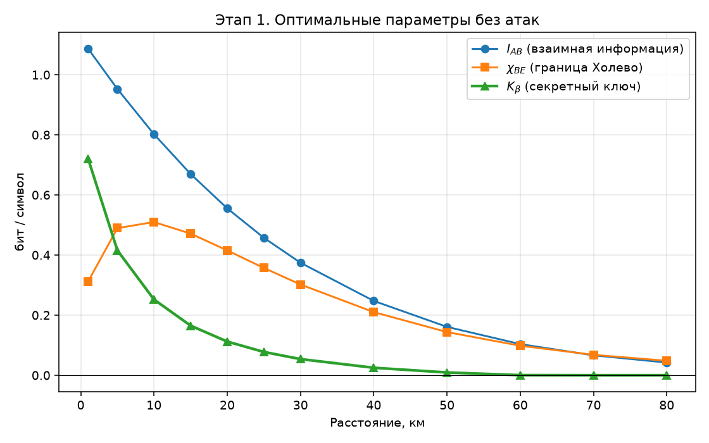
**Рисунок 7.1** — Метрики базового режима `I_AB`, `χ_BE`, `K_β` в зависимости от
дистанции (готовый график `results/study/figures/baseline_metrics.png`).

### 7.2 Влияние параметров канала и настроек протокола на ключевые показатели

- **Дистанция/трансмиссивность.** Рост `L` уменьшает `T`, снижает `I_AB` и
  формирует «горб» `χ_BE`; это фундаментальный, неуправляемый фактор.
- **Амплитуда `α` (`V_A`).** Рост `α` поднимает И `I_AB`, И `χ_BE` почти
  параллельно — чистый выигрыш `K_β` умеренный и универсальный.
- **Эффективность `β`.** Не меняет `I_AB`/`χ_BE`, входит линейным множителем в
  `K_β` — слабый, но «бесплатный» рычаг.
- **Избыточный шум `ξ_eff`.** Рост `ξ_eff` увеличивает `χ_BE` и снижает `K_β`;
  снижается калибровкой.

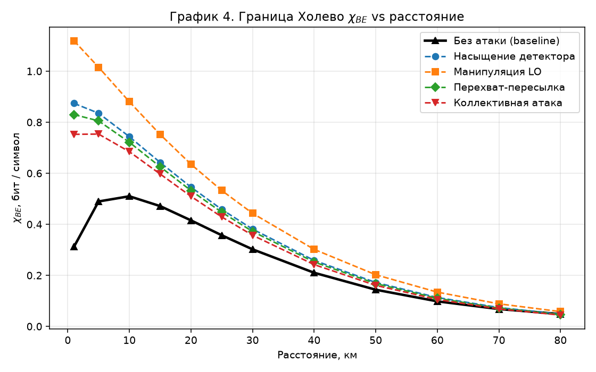
**Рисунок 7.2** — Граница Холево `χ_BE` от дистанции (baseline и атаки);
`results/study/figures/chi_vs_distance.png`.

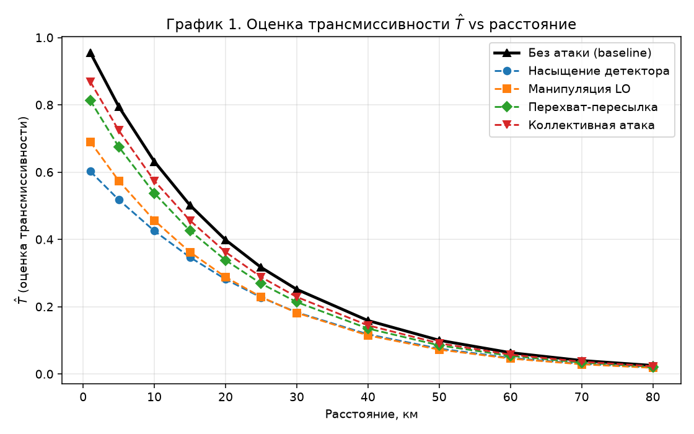
**Рисунок 7.3** — Оценка трансмиссивности `T̂` от дистанции;
`results/study/figures/trans_vs_distance.png`.

### 7.3 Результаты при моделировании атак

**Атака насыщения детектора.** Клиппинг даёт `ξ_eff ≈ 0.2 SNU` и занижает `T̂`
(на 1 км `0.955 → 0.60`). `K_β` на 1 км падает `0.72 → 0.12`, к 25 км — до нуля.

**Атака манипуляции LO** (`s = 0.85`). Самая опасная: `ξ_eff ≈ 0.38 SNU`,
`χ_BE` поднимается выше `β·I_AB`, и `K_β → 0` уже на 1 км.

| Сценарий (1 км) | `T̂` | `ξ_eff` | `χ_BE` | `K_β` |
|---|---|---|---|---|
| baseline | 0.955 | 0.015 | 0.312 | **0.721** |
| насыщение | 0.602 | 0.200 | 0.874 | 0.122 |
| LO (`s=0.85`) | 0.690 | 0.384 | 1.119 | **0.000** |

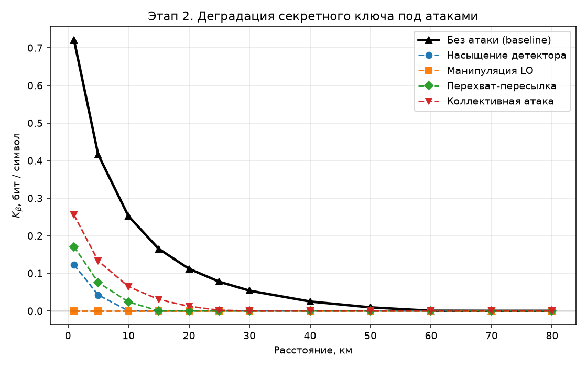
**Рисунок 7.4** — `K_β` от дистанции для baseline и атак;
`results/study/figures/attacks_kbeta.png`.

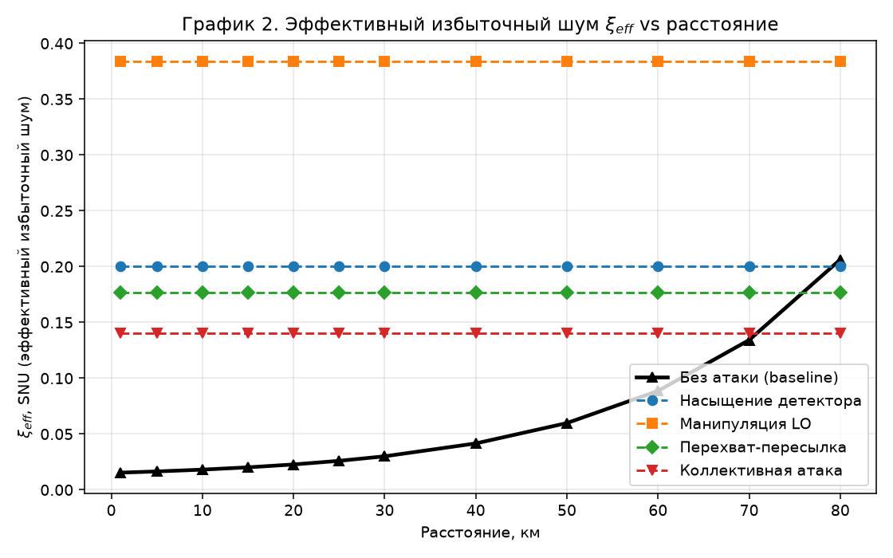
**Рисунок 7.5** — Эффективный избыточный шум `ξ_eff` от дистанции;
`results/study/figures/xi_vs_distance.png`.

**Восстановление (этап 3).** Подбором параметров:
- **Насыщение** восстанавливается практически полностью за счёт калибровки
  (поднятие порога АЦП `sat`) + `α = 3`, `β = 0.98`: `K_β` на 1 км `0.12 → 1.32`,
  на 25 км `0 → 0.13`.
- **LO** восстанавливается восстановлением калибровки (`s → 1.0`): `K_β` на 1 км
  `0 → 0.99`. Подбор только `α` или только `β` ключ НЕ восстанавливает.

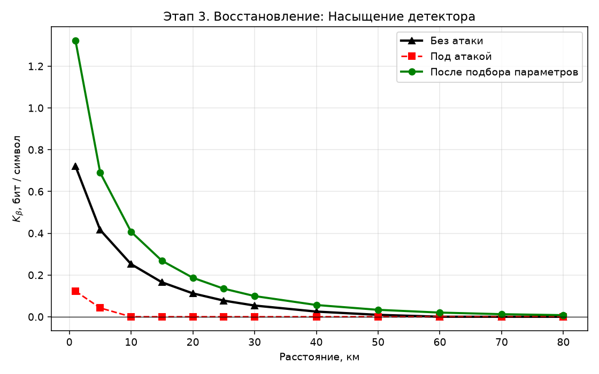
**Рисунок 7.6** — Восстановление при насыщении: стратегии подбора параметров;
`results/study/figures/recovery_saturation.png`.

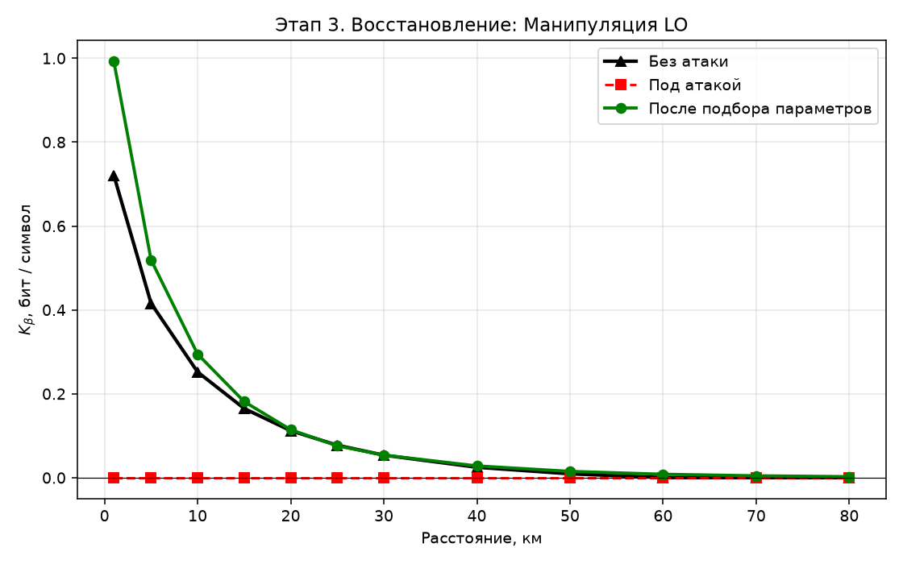
**Рисунок 7.7** — Восстановление при манипуляции LO: только калибровка возвращает
секретность; `results/study/figures/recovery_lo.png`.

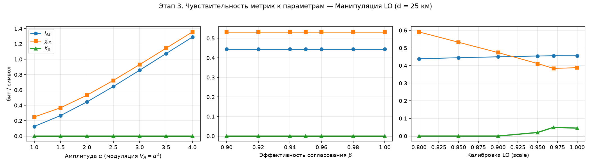
**Рисунок 7.8** — Чувствительность метрик к отдельным параметрам (LO, `L=25 км`);
`results/study/figures/sensitivity_lo.png`.

### 7.4 Сравнение характеристик системы в присутствии и отсутствии атак

| Показатель | Без атак | Насыщение | LO (`s=0.85`) |
|---|---|---|---|
| `K_β` на 1 км | 0.72 | 0.12 | 0.00 |
| Дальность секретности | ~55–60 км | ≲ 5–10 км | 0 км |
| Признак атаки в `T̂` | нет | сильное занижение | занижение |
| Восстановление | — | калибровка + `α,β` (полное) | калибровка LO (полное) |

Главный вывод: обе атаки бьют не столько по «полезному» каналу A–B (`I_AB`
меняется слабо), сколько по утечке к Еве (`χ_BE` растёт через `ξ_eff`). Поскольку
это атаки на калибровку/железо приёмника, они **парируются восстановлением
калибровки** — в отличие от фундаментальных квантовых атак.

### 7.5 Наблюдаемые границы применимости протокола

- **Дальность.** При оптимальных параметрах протокол секретен до ~55–60 км;
  далее `K_β → 0` из-за роста `χ_tot ≈ 1/T` и схлопывания `I_AB`.
- **Шумовой порог.** Существует критический `ξ_eff`, выше которого `β·I_AB < χ_BE`
  и ключ обнуляется; именно превышение этого порога вызывают атаки.
- **Параметрический запас.** Увеличение `α` и `β` сдвигает границу применимости,
  но против атак на калибровку решающим является восстановление самой калибровки
  (порог АЦП, амплитуда LO), а не наращивание модуляции.

---

## Приложение А. Сводный список рисунков

| № | Файл | Тип | Раздел |
|---|---|---|---|
| 2.1 | `figures/fig_2_1_task_stages.png` | блок-схема (mermaid) | 2.1 |
| 2.2 | `figures/fig_2_2_usecase.png` | use-case (mermaid) | 2.1 |
| 2.3 | `figures/fig_2_3_attack_classes.png` | диаграмма классов (mermaid) | 2.3 |
| 2.4 | `figures/fig_2_4_criteria_tree.png` | иерархия критериев (mermaid) | 2.4 |
| 3.1 | `figures/fig_3_1_qpsk_constellation.png` | созвездие QPSK (matplotlib) | 3.1 |
| 3.2 | `figures/fig_3_2_channel.png` | модель канала (mermaid) | 3.2 |
| 3.3 | `figures/fig_3_3_heterodyne.png` | схема гетеродина (mermaid) | 3.3 |
| 3.4 | `figures/fig_3_4_phase_sectors.png` | секторы фазы (matplotlib) | 3.4 |
| 3.5 | `figures/fig_3_6_security_dataflow.png` | поток расчёта безопасности (mermaid) | 3.6 |
| 3.6 | `figures/fig_3_7_postproc.png` | конвейер постобработки (mermaid) | 3.7 |
| 3.7 | `figures/fig_3_8_attacks.png` | модели атак (mermaid) | 3.8 |
| 4.1 | `figures/fig_4_1_layers.png` | архитектура слоёв (mermaid) | 4.1 |
| 4.2 | `figures/fig_4_1a_pipeline.png` | конвейер `run_one_point` (mermaid) | 4.1 |
| 4.3 | `figures/fig_4_1b_sequence.png` | sequence-диаграмма (mermaid) | 4.1 |
| 4.4 | `figures/fig_4_2_modules.png` | диаграмма модулей (mermaid) | 4.2 |
| 4.5 | `figures/fig_4_3_core_classes.png` | классы ядра (mermaid) | 4.2 |
| 4.6 | `figures/fig_4_4_build_stack.png` | стек сборки (mermaid) | 4.3 |
| 5.1 | `figures/fig_5_2_attack_integration.png` | интеграция атак (mermaid) | 5.2 |
| 6.1 | `figures/fig_6_methodology.png` | методика серий (mermaid) | 6.4 |
| 7.1–7.8 | `results/study/figures/*.png` | графики результатов (matplotlib) | 7 |

Исходники mermaid-диаграмм — в `results/study/report2/mmd/*.mmd`; их можно
открыть/доработать в [mermaid.live](https://mermaid.live) или draw.io
(импорт mermaid). Скрипт физических рисунков — `report2/make_physics_figs.py`.
