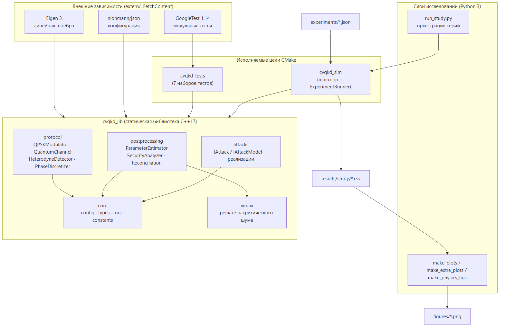
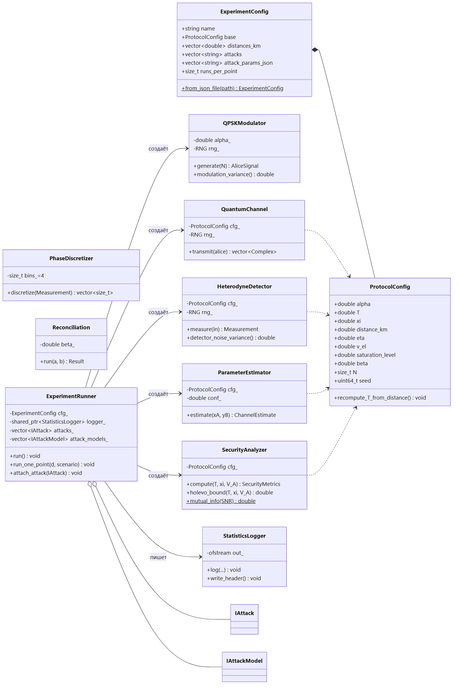
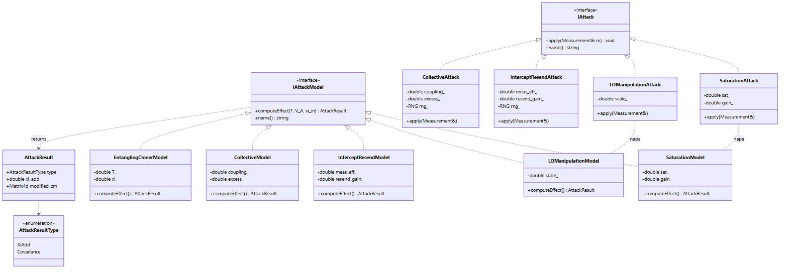
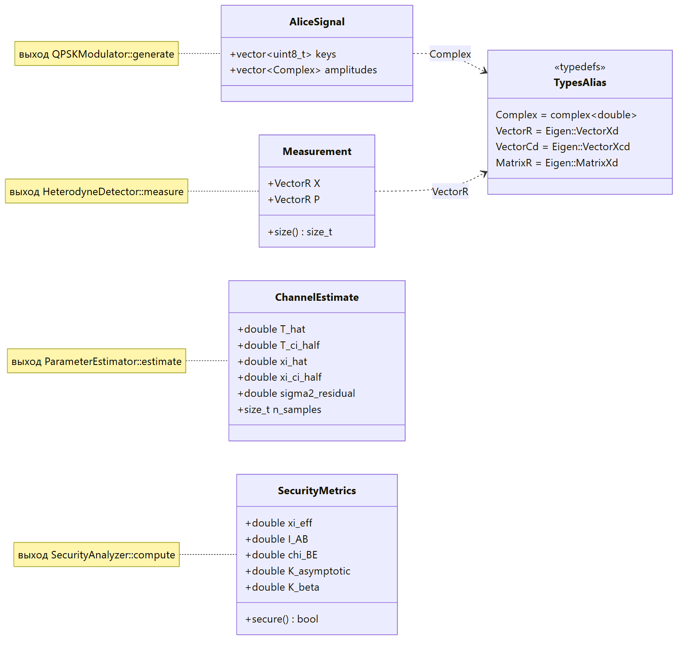
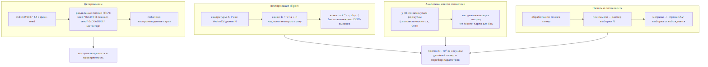
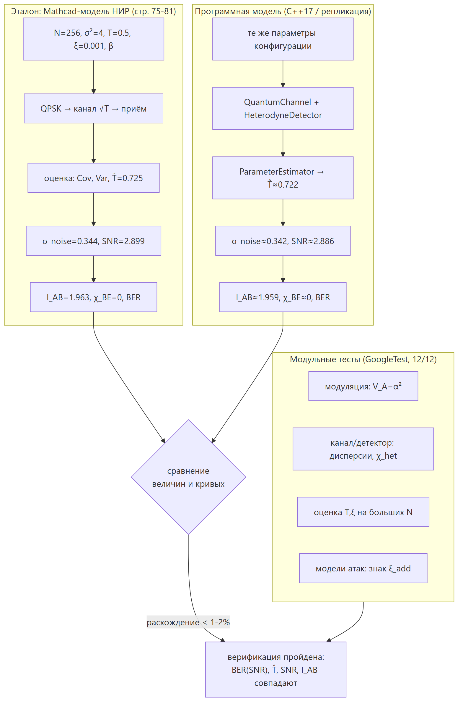
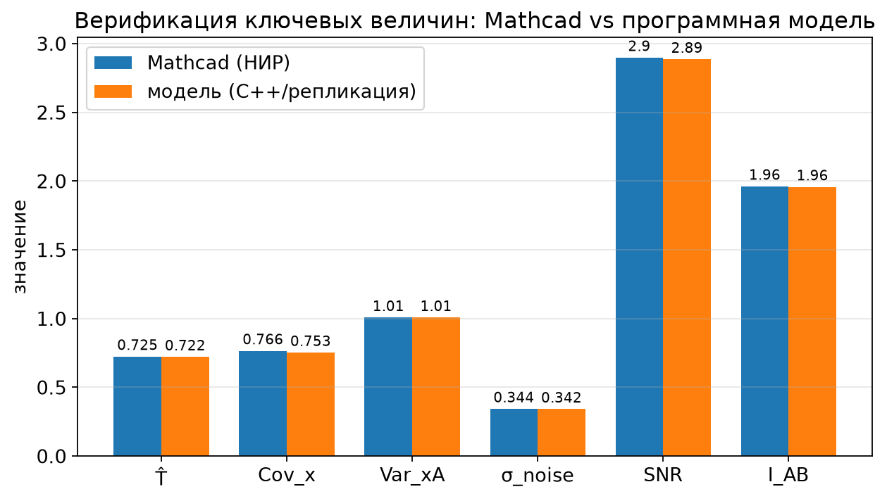
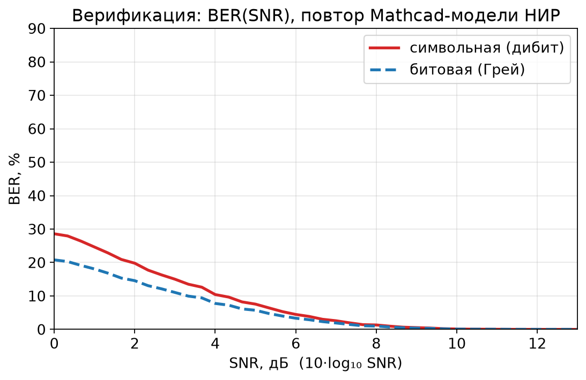

# Программная модель BB84-like CV-QKD: постановка задачи, математический аппарат, архитектура, эксперименты и результаты

> Документ заполняет каркас разделов 2–7 на основе программной реализации
> [QWEticker/NIR](https://github.com/QWEticker/NIR). Терминология, трёхуровневая
> концептуальная модель и стиль изложения согласованы с отчётом по НИР
> «Моделирование квантового распределения ключей по BB84-подобному протоколу с
> непрерывными переменными». Все формулы соответствуют исходному коду
> (`security_analyzer.cpp`, `parameter_estimator.cpp`, `quantum_channel.cpp`,
> `heterodyne_detector.cpp`, модели атак). Числовые результаты получены прогоном
> симулятора и хранятся в `results/study/*.csv`.
>
> **Фокус по атакам** (по согласованию): рассматриваются две практические атаки,
> специфичные для CV-QKD — **насыщение детектора** и **манипуляция локальным
> осциллятором (LO)**. Остальные модели (перехват-пересылка, коллективная) в коде
> присутствуют, но в данном документе используются лишь как контекст.

Все шумовые величины приведены в единицах дробового шума (SNU, shot-noise units),
в которых дисперсия вакуума равна 1.

---

## 2 ПОСТАНОВКА ЗАДАЧИ И ТРЕБОВАНИЯ К ПРОГРАММНОЙ МОДЕЛИ

### 2.1 Формализация цели и задач моделирования

**Цель** — построить программную модель BB84-подобного протокола квантового
распределения ключей с непрерывными переменными (BB84-like CV-QKD) на когерентных
состояниях с QPSK-модуляцией и гетеродинным детектированием, которая позволяет
количественно оценивать защищённость протокола и её деградацию под действием
практических атак на приёмную часть, а также исследовать восстановление
защищённости подстройкой параметров системы.

Формально модель реализует отображение
> **M = F(θ, A)**,

где `θ` — вектор параметров системы и канала (амплитуда модуляции `α`, длина линии
`L` и трансмиссивность `T`, избыточный шум `ξ`, квантовая эффективность `η`,
электронный шум `v_el`, порог насыщения `sat`, эффективность согласования `β`,
число импульсов `N`, seed); `A` — конфигурация атаки (тип и её параметры);
`M = {Î_AB, χ̂_BE, K_asymp, K_β, secure, T̂, ξ̂}` — вектор выходных метрик.

Исследование разбито на **три этапа** (рис. 2.1):
1. **Базовый режим** — при оптимальных параметрах из литературы (Huang et al.,
   npj QI 2016; Grosshans–Grangier, PRL 2002) выполняется sweep по дистанции и
   фиксируется зависимость метрик `M(L)` без атак.
2. **Атаки** — при тех же параметрах подключаются насыщение и манипуляция LO;
   фиксируется деградация `M(L)`.
3. **Восстановление** — перебором параметров `θ` (`α`, `β`, калибровка) ищется
   режим `argmax K_β(L | θ, A)`, при котором защищённость восстанавливается.

**Задачи моделирования:**
- реализовать полный конвейер протокола: источник → канал → гетеродин →
  дискретизация → оценка параметров → расчёт `I_AB`, `χ_BE`, `K_β`;
- обеспечить подключаемую модель атак на приёмную часть;
- реализовать систему критериев оценки защищённости (раздел 2.4);
- обеспечить воспроизводимые серии экспериментов с журналированием в CSV;
- автоматизировать построение графиков для анализа зависимостей метрик.


**Рисунок 2.1** — Концептуальная схема постановки задачи: три этапа исследования
(базовый режим → атаки → восстановление).


**Рисунок 2.2** — Диаграмма вариантов использования (use-case) программной модели
с точки зрения исследователя.

### 2.2 Функциональные и нефункциональные требования к модели BB84-like CV-QKD

**Функциональные требования (ФТ).** Система должна моделировать полный цикл
BB84-подобного протокола с непрерывными переменными:

| № | Требование | Реализация в коде |
|---|---|---|
| ФТ-1 | Генерация Алисой случайных битовых пар и отображение в 4 когерентных состояния `α·iᵏ` | `QPSKModulator::generate` |
| ФТ-2 | Модуляция с заданной амплитудой `α`, дисперсия модуляции `V_A = α²` | `QPSKModulator::modulation_variance` |
| ФТ-3 | Передача через квантовый канал с параметрами `T` и `ξ` | `QuantumChannel::transmit` |
| ФТ-4 | Гетеродинное измерение Бобом, получение пар `(X, P)` | `HeterodyneDetector::measure` |
| ФТ-5 | Дискретизация измерений по фазовому углу на 4 сектора | `PhaseDiscretizer` |
| ФТ-6 | Оценка параметров канала `T̂`, `ξ̂` и доверительных интервалов | `ParameterEstimator::estimate` |
| ФТ-7 | Расчёт `I_AB`, границы Холево `χ_BE` и секретной скорости `K_β` | `SecurityAnalyzer::compute` |
| ФТ-8 | Информационное согласование в режиме обратного согласования (`β·I_AB`) | `Reconciliation::run` |
| ФТ-9 | Подключаемые модели атак (насыщение, LO) | `IAttack`, `IAttackModel` |
| ФТ-10 | Параметризация через конфигурационные файлы JSON | `ProtocolConfig`, `ExperimentConfig::from_json_file` |
| ФТ-11 | Сбор статистики и экспорт в CSV | `StatisticsLogger` |

**Нефункциональные требования** вынесены в раздел 2.5.

### 2.3 Требования к архитектуре модуля моделирования атак

Модуль атак должен удовлетворять следующим требованиям:
- **Единый интерфейс.** Каждая атака реализует общий контракт, чтобы её можно было
  подключать без изменения ядра протокола (паттерн «Стратегия»). В коде это две
  параллельные иерархии:
  - `IAttack` — *симуляционная* ветвь: метод `apply(Measurement& m)` искажает
    отсчёты Боба на уровне выборки (влияет на оценку `T̂`, `ξ̂`);
  - `IAttackModel` — *аналитическая* ветвь: метод
    `computeEffect(T, V_A, ξ_in) → AttackResult` возвращает добавочный избыточный
    шум `ξ_add`, который входит в расчёт `χ_BE`.
- **Расширяемость.** Добавление новой атаки = новый класс-наследник без
  модификации `ExperimentRunner`.
- **Композиция.** Несколько атак подключаются одновременно; их вклады в `ξ_eff`
  суммируются.
- **Соответствие физике.** Параметры атаки имеют ясный физический смысл (порог
  насыщения `sat`, усиление `gain`, масштаб LO `scale`).


**Рисунок 2.3** — Диаграмма классов модуля атак: интерфейсы `IAttack`/`IAttackModel`
и их реализации для насыщения и манипуляции LO (паттерн «Стратегия»).

### 2.4 Требования к системе критериев оценки

Система критериев должна вычислять следующую цепочку величин (рис. 2.4):
1. **Сырые измерения** Боба `(X, P)`.
2. **Оценки канала**: `T̂`, `ξ̂`, эффективный шум `ξ_eff`, доверительные интервалы
   (95 %).
3. **Информационные величины**: взаимная информация `I_AB` и граница Холево
   `χ_BE` (информация, доступная Еве).
4. **Ключевые скорости**: асимптотическая `K_asymp = I_AB − χ_BE` и практическая
   `K_β = max(0, β·I_AB − χ_BE)`.
5. **Признак защищённости** `secure ≡ (K_β > 0)` и производная **дальность
   секретности** `L_max` — максимальная длина линии, при которой `K_β > 0`.

Требования: метрики должны вычисляться для каждой точки `(L, сценарий)`,
сохраняться в журнал и быть пригодны для построения зависимостей от дистанции и
от параметров.


**Рисунок 2.4** — Иерархия системы критериев оценки: от сырых измерений к признаку
защищённости и дальности.

### 2.5 Нефункциональные требования

| Категория | Требование |
|---|---|
| **Производительность** | Прогон `N = 6·10⁵…10⁶` импульсов на точку за секунды на стандартном ПК; векторизованные операции (Eigen). |
| **Масштабируемость/расширяемость** | Модульная структура; замена моделей канала, согласования, атак без перестройки ядра; единый интерфейс запуска. |
| **Кроссплатформенность** | C++17, сборка через CMake; отсутствие проприетарных зависимостей; собрано под Windows (MinGW-w64) и Linux/GCC. |
| **Воспроизводимость** | Детерминированный ГПСЧ с фиксируемым `seed`; полный набор параметров и метрик в CSV/JSON-логах. |
| **Тестируемость** | Покрытие компонентов модульными тестами (GoogleTest), сверка с аналитической Mathcad-моделью предыдущей НИР. |

---

## 3 МАТЕМАТИЧЕСКИЙ АППАРАТ BB84-LIKE CV-QKD В РАМКАХ ПРОГРАММНОЙ РЕАЛИЗАЦИИ

### 3.1 Математическое описание источника и модуляции (QPSK когерентных состояний)

Алиса кодирует пару случайных битов в индекс `k ∈ {0,1,2,3}` и формирует одно из
четырёх когерентных состояний, равномерно расположенных по окружности в фазовом
пространстве:
> **a_k = α · iᵏ,  k = 0,1,2,3,**

то есть точки `(+α, 0)`, `(0, +α)`, `(−α, 0)`, `(0, −α)`. Амплитуда `α`
задаёт **дисперсию модуляции** (на обе квадратуры):
> **V_A = α²** (в SNU), а полная дисперсия моды Алисы `V = V_A + 1`.

Чем больше `α`, тем «различимее» состояния и тем больше взаимная информация на
символ, однако усиление сигнала почти одинаково помогает и Бобу, и Еве (см. 3.6).
В коде модуляция реализована классом `QPSKModulator` (`generate(N)` возвращает
ключи `k` и комплексные амплитуды; `modulation_variance()` = `α²`).


**Рисунок 3.1** — Созвездие QPSK когерентных состояний `a = α·iᵏ`; облака —
квантовая/канальная неопределённость, красные точки — идеальные положения.

### 3.2 Модель квантового канала с трансмиссивностью T и избыточным шумом ξ

Оптоволоконная линия моделируется как линейный канал с затуханием и аддитивным
гауссовым шумом. Трансмиссивность для волокна с погонными потерями `0.2 дБ/км`:
> **T = 10^(−0.2·L/10)**, `L` — длина линии в км.

Преобразование амплитуды Алисы в сигнал на входе Боба:
> **b = √T · a + n,  n ~ CN(0, T·ξ)** (дисперсия `T·ξ/2` на каждую квадратуру),

где `ξ` — избыточный шум сверх дробового (ключевой параметр безопасности).
Реализация — `QuantumChannel::transmit` (масштабирование на `√T`, добавление
гауссова шума с дисперсией, пропорциональной `T·ξ`). При фиксированной модуляции
существует критический уровень `ξ`, выше которого `K_β` обращается в ноль.


**Рисунок 3.2** — Модель квантового канала: затухание `×√T` и инжекция гауссова
шума с дисперсией `T·ξ/2`.

### 3.3 Модель гетеродинного измерения и шумов приёмника

Боб использует **гетеродинное** детектирование — одновременное измерение обеих
квадратур `X` и `P` (сигнал делится на светоделителе 50/50, две гомодинные ветви).
Квантовая эффективность детектора `η` и электронный шум `v_el` дают:
> **X = √η · Re(b) + ν_x,  P = √η · Im(b) + ν_p,**

с дисперсией детекторного шума `σ_det² = (1 + v_el)/η`. Совокупный шум гетеродина,
приведённый ко входу:
> **χ_het = (2 − η + 2·v_el) / η.**

Гетеродин вносит дополнительную единицу вакуумного шума (отсюда «2» в числителе) —
плата за одновременное измерение двух квадратур. Реализация —
`HeterodyneDetector::measure` и `detector_noise_variance()`.


**Рисунок 3.3** — Схема гетеродинного приёмника и формирование шума `χ_het`.

### 3.4 Процедура дискретизации по фазовому углу

Для перехода от непрерывных отсчётов к дискретным символам вычисляется фазовый
угол `φ = atan2(P, X)` и определяется номер сектора:
> **k̂ = ⌊(φ + π/4) / (π/2)⌋ mod 4.**

Комплексная плоскость делится на 4 сектора по 90°, центрированных на положениях
созвездия; отсчёт относится к ближайшему по фазе состоянию. Реализация —
`PhaseDiscretizer`. Дискретизация используется для оценки ошибок символа и как
мост между непрерывными измерениями и «битовой» логикой BB84.


**Рисунок 3.4** — Дискретизация по фазовому углу: разбиение на 4 сектора и правило
отнесения измерения `(X,P)` к сектору `k̂`.

### 3.5 Оценка параметров канала (оценка T̂, ξ̂ и доверительных интервалов)

По парам «переданное–принятое» `(x_A, y_B)` методом наименьших квадратов
оценивается линейная модель `y_B = √(η·T̂)·x_A + шум`. Из наклона восстанавливается
`T̂`, из дисперсии остатков — избыточный шум:
> **ξ̂ = (σ²_resid − σ²_shot − σ²_det) / (η·T̂)** (с занулением отрицательных
> значений),

а также **доверительные интервалы 95 %** для `T̂` и `ξ̂` (полуширины
`T_ci_half`, `xi_ci_half`) по дисперсии оценок на конечной выборке. Реализация —
`ParameterEstimator::estimate`, возвращает структуру `ChannelEstimate`
(`T_hat`, `xi_hat`, `T_ci_half`, `xi_ci_half`, `sigma2_residual`, `n_samples`).

**Важная деталь модели атак.** Рассмотренные атаки масштабируют отсчёты Боба,
поэтому «сырая» оценка `ξ̂` зануляется (атака маскируется под потери, а не под
шум). Реально влияющий на безопасность шум вынесен в отдельную величину
`ξ_eff = ξ̂ + Σ ξ_add`, где `ξ_add` даёт аналитическая модель атаки (см. 3.8).

### 3.6 Расчёт взаимной информации и границы Холево

**Взаимная информация Алиса–Боб** (гетеродин, гауссова модуляция):
> **I_AB = log₂( (V + χ_tot) / (1 + χ_tot) ),**

где `V = V_A + 1`, суммарный приведённый шум
> **χ_line = (1 − T)/T + ξ,  χ_tot = χ_line + χ_het/T.**

**Граница Холево** `χ(B:E)` для когерентного CV-QKD с гетеродином, **обратным
согласованием** и доверенным детектором (Laudenbach et al. 2018; Fossier et al.
2009) считается через симплектические собственные значения ковариационной
матрицы `Γ_AB` и условной матрицы после измерения Боба:
> **χ_BE = G(ν₁) + G(ν₂) − G(ν₃) − G(ν₄),**
> **G(ν) = (x+1)·log₂(x+1) − x·log₂(x),  x = (ν−1)/2.**

Собственные значения `ν₁,ν₂` (моды A,B) и `ν₃,ν₄` (условная матрица) выражаются
через инварианты `A`, `B`, `C`, `D`, построенные из `V`, `T`, `χ_line`, `χ_het`
(реализация `SecurityAnalyzer::holevo_bound`, листинг ниже соответствует коду).

`χ_BE` имеет **немонотонную** зависимость от дистанции («горб»): на малых `L`
потери малы и Еве достаётся мало, на больших `L` сигнал тонет в шуме — максимум
утечки приходится на средние дистанции.


**Рисунок 3.5** — Поток данных расчёта безопасности: от `(T, ξ_eff, V_A)` к
`I_AB`, `χ_BE` и `K_β` через симплектические собственные значения.

### 3.7 Модель информационного согласования и усиления конфиденциальности

Реальные коды коррекции извлекают не всю взаимную информацию, а долю `β·I_AB`,
где `β ∈ (0, 1]` — **эффективность согласования** (в литературе `β ≈ 0.95`).
Практическая секретная скорость (обратное согласование):
> **K_β = max(0, β·I_AB − χ_BE).**

Учитывается конечно-ключевая поправка вида `Δ(n, ε) ≈ 6·√(ln(1/ε)/n)/ln2`
(модуль `FiniteKeyAnalyzer`). Усиление конфиденциальности (хеширование) укорачивает
ключ до безопасной длины. Реализация — `Reconciliation::run` (даёт `β·I_AB`),
итоговый `K_β` собирается в `SecurityAnalyzer::compute`.


**Рисунок 3.6** — Конвейер постобработки: согласование → конечно-ключевая поправка
→ усиление конфиденциальности → секретный ключ.

### 3.8 Модель атак (в математических терминах)

**Атака насыщения детектора.** Ева/нелинейность приёмника обрезают отсчёты по
амплитуде. Симуляция (`SaturationAttack::apply`):
> **X ← clip(gain·X, ±sat),  P ← clip(gain·P, ±sat).**

Аналитический вклад в шум (`SaturationModel::computeEffect`):
> **ξ_add = max(0, (V − sat²)/V),  V = V_A + 1** (домножается на `|gain|`, если
> `gain ≠ 1`).

Смысл: клиппинг «срезает» дисперсию сигнала, что приёмник интерпретирует как рост
шума и снижение `T̂`.

**Атака манипуляции локальным осциллятором (LO).** Ева занижает/завышает амплитуду
опорного луча, что эквивалентно масштабированию измеренных квадратур. Симуляция
(`LOManipulationAttack::apply`):
> **X ← s·X,  P ← s·P.**

Аналитический вклад (`LOManipulationModel::computeEffect`):
> **ξ_add = max(0, 1/s² − 1).**

Смысл: занижение LO (`s < 1`) ломает калибровку дробового шума — приёмник
недооценивает уровень shot-noise, что эквивалентно инжекции избыточного шума.
Оба вклада суммируются в `ξ_eff` и через `χ_BE` снижают `K_β`.


**Рисунок 3.7** — Математические модели атак: насыщение (клиппинг → `ξ_add`) и
манипуляция LO (масштаб → `ξ_add`); общий выход — рост `ξ_eff` и `χ_BE`.

---

## 4 АРХИТЕКТУРА И ПРОГРАММНАЯ РЕАЛИЗАЦИЯ МОДЕЛИ

### 4.1 Общая архитектура программного комплекса

Программный комплекс спроектирован как **многослойная система с чётким
разделением ответственности** (separation of concerns), что согласовано с
трёхуровневой концептуальной моделью КРК предыдущей НИР: физический уровень
(источник, канал, приёмник), уровень протокола (дискретизация, оценка
параметров) и уровень постобработки (согласование, усиление конфиденциальности,
анализ защищённости). Такое разделение обеспечивает независимую разработку,
тестирование и замену компонент без перестройки остальной системы.

Выделяются три слоя.

1. **Слой ядра** — статическая библиотека `cvqkd_lib` (C++17). Содержит всю
   физику и математику протокола и не зависит ни от способа запуска, ни от
   формата вывода. Внутренне разбит на пакеты `core` (конфигурация, типы, ГПСЧ,
   константы), `protocol` (модуляция, канал, детектор, дискретизация),
   `postprocessing` (оценка параметров, анализ безопасности, согласование),
   `attacks` (две параллельные иерархии моделей атак) и `ximax` (решатель
   критического избыточного шума). Сборка библиотеки выполняется по
   `file(GLOB_RECURSE src/*.cpp)` с исключением тестовых единиц трансляции.
2. **Слой драйвера** — `main.cpp` + класс `ExperimentRunner`. Драйвер читает
   JSON-конфигурацию серии (`ExperimentConfig::from_json_file`), создаёт по ней
   объекты ядра, выполняет sweep по дистанциям и направляет метрики в
   `StatisticsLogger` (CSV). Драйвер — единственное место, где «знают» про
   формат файлов.
3. **Слой исследований** — Python 3: `scripts/run_study.py` оркеструет серии
   (baseline → атаки → восстановление → чувствительность), а
   `make_plots.py` / `make_extra_plots.py` / `report2/make_physics_figs.py`
   строят графики из CSV. Этот слой не трогает ядро и общается с ним только через
   CSV/JSON-артефакты.

Поток артефактов однонаправленный: `experiments/*.json → cvqkd_sim →
results/study/*.csv → figures/*.png`. Благодаря этому любой этап воспроизводим и
кэшируем по отдельности.


**Рисунок 4.1** — Трёхслойная архитектура: ядро C++ → драйвер → слой исследований
на Python; артефакты JSON → CSV → PNG.

Более детальный взгляд — **диаграмма компонентов**: внешние зависимости
(Eigen, nlohmann/json, GoogleTest), внутренние пакеты `cvqkd_lib`, исполняемые
цели CMake (`cvqkd_sim`, `cvqkd_tests`) и слой исследований с их связями.


**Рисунок 4.2** — Диаграмма компонентов программного комплекса: внешние
библиотеки, пакеты ядра, исполняемые цели и Python-слой.

Логику расчёта одной точки эксперимента инкапсулирует метод
`ExperimentRunner::run_one_point(dist, scenario)`. Его конвейер: пересчёт `T` по
дистанции → генерация сигнала Алисы → прохождение канала → гетеродинное
измерение → (при наличии) применение симуляционных атак к выборке → формирование
векторов `(x_A, y_B)` по **обеим** квадратурам → оценка `T̂, ξ̂` → добавление
аналитического `ξ_add` атак в `ξ_eff` → расчёт `I_AB, χ_BE, K_β` → запись строки
CSV. Блок-схема и диаграмма последовательности приведены ниже.


**Рисунок 4.3** — Блок-схема конвейера `run_one_point`: от JSON-конфига до строки
CSV (включая ветвление по наличию атак).


**Рисунок 4.4** — Sequence-диаграмма взаимодействия объектов при расчёте одной
точки эксперимента (`ExperimentRunner` ↔ модули ядра ↔ `StatisticsLogger`).

### 4.2 Организация программных модулей

Комплекс разбит на **восемь функциональных модулей**, соответствующих этапам
конвейера протокола. Ниже — назначение каждого, ключевые классы и точные формулы
из кода.

| № | Модуль (каталог) | Назначение | Ключевые классы / методы |
|---|---|---|---|
| 1 | генерация и модуляция (`protocol`) | источник QPSK когерентных состояний `a = α·iᵏ`; `V_A = α²` | `QPSKModulator::generate`, `modulation_variance` |
| 2 | квантовый канал (`protocol`) | затухание `b = √T·a + n`, шум `n ~ N(0, T·ξ/2)` на квадратуру | `QuantumChannel::transmit` |
| 3 | измерение, гетеродин (`protocol`) | `X = √η·Re(b)+ν`, `P = √η·Im(b)+ν`, `σ²_det = (1+v_el)/η` | `HeterodyneDetector::measure`, `detector_noise_variance` |
| 4 | дискретизация и постобработка (`protocol`/`postprocessing`) | секторизация по фазе `φ = atan2(P,X)`; модель согласования | `PhaseDiscretizer::discretize`, `Reconciliation::run` |
| 5 | оценка параметров (`postprocessing`) | МНК-оценка наклона `√(η·T̂)`, дисперсии остатков → `T̂, ξ̂`, ДИ 95 % | `ParameterEstimator::estimate` → `ChannelEstimate` |
| 6 | расчёт `I_AB, χ_BE` и секретной скорости (`postprocessing`) | `I_AB`, граница Холево через симплектические с.з., `K_β` | `SecurityAnalyzer::compute`, `holevo_bound` |
| 7 | моделирование атак (`attacks`) | две иерархии: искажение выборки и аналитический `ξ_add` | `IAttack::apply`, `IAttackModel::computeEffect` |
| 8 | сбор/хранение/визуализация (`experiment` + Python) | построчный CSV-журнал; графики | `StatisticsLogger::log`, `run_study.py`, `make_*_plots.py` |

Зависимости модулей и центральная роль пакета `core` (предоставляет
`ProtocolConfig`, типы и ГПСЧ всем остальным) показаны на диаграмме пакетов;
полная **UML-диаграмма классов** ядра и **детальная иерархия модуля атак**
приведены отдельно.


**Рисунок 4.5** — Диаграмма модулей (пакетов) и их зависимостей; `core`
предоставляет конфиг/типы/ГПСЧ, `ximax` — расчёт критического шума.


**Рисунок 4.6** — Полная UML-диаграмма классов ядра: `ExperimentRunner` как
оркестратор, классы протокола и постобработки, агрегирование `IAttack`/
`IAttackModel`, композиция `ExperimentConfig ◆— ProtocolConfig` и зависимости от
`ProtocolConfig`.


**Рисунок 4.7** — Детальная диаграмма классов модуля атак: интерфейсы
`IAttack`/`IAttackModel`, пять аналитических моделей и четыре симуляционные
реализации, возврат `AttackResult` с перечислением `AttackResultType`.

Структуры-носители данных, передаваемые между модулями (выходы каждого этапа),
вынесены на отдельную **диаграмму данных**.


**Рисунок 4.8** — Модель данных: `AliceSignal`, `Measurement`, `ChannelEstimate`,
`SecurityMetrics`, `AttackResult` и псевдонимы типов Eigen (`VectorR`, `Complex`).

### 4.3 Используемые библиотеки и средства

- **Линейная алгебра** — [Eigen 3](https://eigen.tuxfamily.org) (header-only, в
  `extern/eigen`). Псевдонимы `VectorR = Eigen::VectorXd`,
  `VectorCd = Eigen::VectorXcd`, `MatrixR/MatrixCd` (`core/types.hpp`). Eigen даёт
  векторизованные операции над всей выборкой квадратур и используется в
  симплектических вычислениях границы Холево.
- **JSON-конфигурация** — [nlohmann/json](https://github.com/nlohmann/json)
  (header-only, в `extern/nlohmann`). Чтение `ExperimentConfig`/`ProtocolConfig`
  и разбор параметров атак (`attack_params_json`).
- **Генераторы случайных чисел** — стандартный `<random>`, Mersenne Twister
  `std::mt19937_64` (модуль `core/rng`). Для развязки источников шума разные
  подсистемы используют **разные потоки**: канал — `seed ^ 0xC0FFEE`, детектор —
  `seed ^ 0xDEADBEEF`, стохастические атаки — `seed + 1000/2000`. Это исключает
  корреляции между шумами канала и приёмника при фиксируемом `seed`.
- **Модульное тестирование** — [GoogleTest 1.14.0](https://github.com/google/googletest),
  подключается через `FetchContent` (`gtest_discover_tests`).
- **Визуализация** — Python 3 + [Matplotlib](https://matplotlib.org)
  (`make_plots.py`, `make_extra_plots.py`, `report2/make_physics_figs.py`,
  `report2/make_verification.py`); диаграммы — Mermaid CLI.
- **Сборка** — CMake ≥ 3.8 (C++17, расширения отключены, `CMAKE_EXPORT_COMPILE_COMMANDS`).
  Флаги оптимизации `/O2` (MSVC, Release) и `-O3` (GCC/Clang, Release),
  предупреждения `/W4` и `-Wall -Wextra`. Цели: `cvqkd_lib` (OUTPUT_NAME `cvqkd`),
  `cvqkd_sim`, `cvqkd_tests`. Собрано под Windows (MinGW-w64/MSVC) и Linux/GCC.


**Рисунок 4.9** — Стек библиотек и цели сборки CMake (`cvqkd_lib`, `cvqkd_sim`,
`cvqkd_tests`).

### 4.4 Выбор базовых структур и алгоритмов (в C++17)

**Структуры данных.**
- `ProtocolConfig` — агрегат физических параметров (`alpha, T, xi, distance_km,
  eta, v_el, saturation_level, beta, N, seed`) с методом
  `recompute_T_from_distance()` (`T = 10^(−0.02·L)`). `ExperimentConfig`
  агрегирует `ProtocolConfig base`, список `distances_km`, список атак и их
  JSON-параметров, `runs_per_point`; конструируется фабричным методом
  `from_json_file`.
- `AliceSignal{keys, amplitudes}` — выход источника; `Measurement{X, P}` — пара
  вещественных векторов Eigen (выход детектора); `ChannelEstimate{T_hat,
  T_ci_half, xi_hat, xi_ci_half, sigma2_residual, n_samples}` — выход оценщика;
  `SecurityMetrics{xi_eff, I_AB, chi_BE, K_asymptotic, K_beta, secure()}` — выход
  анализатора; `AttackResult{type, xi_add, modified_cm}` с тегом
  `AttackResultType ∈ {XiAdd, Covariance}`.

**Алгоритмы.**
- **Оценка параметров** — метод наименьших квадратов на объединённой выборке из
  обеих квадратур (`xx = ‖x‖²`, `slope = ⟨x,y⟩/xx`, `T̂ = slope²/η`); избыточный
  шум — из дисперсии остатков: `ξ̂ = 2·(σ²_resid − (1+v_el)/η)/slope²` с
  занулением отрицательных значений; ДИ 95 % через `se_T = 2|slope|·√(σ²_resid/xx)/η`.
- **Граница Холево** — замкнутые формулы через инварианты `A, B, C, D` и
  симплектические собственные значения `ν₁…ν₄` (без численной диагонализации):
  `χ_BE = G(ν₁)+G(ν₂)−G(ν₃)−G(ν₄)`. Это `O(1)` на точку и численно устойчиво.
- **Полиморфизм атак** — паттерн «Стратегия»: `ExperimentRunner` хранит
  `vector<unique_ptr<IAttack>>` и `vector<unique_ptr<IAttackModel>>`, наполняемые
  по строковому имени атаки из конфигурации (фабрика в конструкторе).
- **Дискретизация** — `k̂ = ⌊φ/2π·bins⌋ mod bins` (`bins = 4`).

### 4.5 Особенности реализации и оптимизации (параллелизм, память, ускорение)

- **Векторизация** через Eigen: канал, детектор и атаки применяются к векторам
  `X`, `P` (например `m.X *= scale` в LO-атаке, поэлементный `clamp` по индексам
  в насыщении). «Горячая» обработка выборки `N ~ 6·10⁵…10⁶` идёт без накладных
  расходов виртуальных вызовов на каждый отсчёт — полиморфизм работает на уровне
  атаки целиком, а не отдельного элемента.
- **Аналитическая граница Холево** вместо стохастической оценки информации Евы:
  расчёт `χ_BE` за `O(1)` позволяет дёшево выполнять sweep по дистанции (12
  точек) и многомерный перебор параметров на этапе восстановления.
- **Разделение симуляции и аналитики атак** (`IAttack` vs `IAttackModel`):
  выборочное искажение влияет на оценку `T̂`/`ξ̂` (атака маскируется под потери),
  а аналитический `ξ_add` корректно входит в `χ_BE` через `ξ_eff = ξ̂ + Σ ξ_add`.
  Это исключает «самообман» оценщика, для которого атаки скрытны.
- **Память** — потоковая обработка по точкам sweep: пиковая память определяется
  размером одной выборки `N`; метрики немедленно агрегируются в строку CSV
  (`out_.flush()` после каждой записи), выборка освобождается.
- **Детерминизм/воспроизводимость** — фиксированный `seed` и развязанные потоки
  ГПСЧ дают побитово воспроизводимые серии; потенциал к распараллеливанию sweep
  по точкам (точки независимы) заложен архитектурно.


**Рисунок 4.10** — Принципы оптимизации: векторизация Eigen, аналитический `χ_BE`,
потоковая память, детерминированные раздельные потоки ГПСЧ.

### 4.6 Модульное тестирование и верификация (сравнение с Mathcad-моделью НИР)

**Модульные тесты (GoogleTest, `cvqkd_tests`).** Покрытие компонентов — 12
тестов в четырёх наборах, все проходят локально (12/12):

| Набор | Тест | Что проверяет |
|---|---|---|
| `QPSKModulator` | `ProducesFourStatesOnly` | ровно 4 состояния, равные доли |
| `QPSKModulator` | `ModulationVariance` | `V_A = α²` (для `α=0.7` → 0.49) |
| `SecurityAnalyzer` | `PositiveKeyAtShortDistance` | `K_β > 0` на малой дистанции |
| `SecurityAnalyzer` | `ZeroKeyAtHighLoss` | `K_β = 0` при больших потерях |
| `AttackModels` | `SaturationReturnsXi` / `LOManipulationReturnsXi` | тип `XiAdd`, `ξ_add ≥ 0` |
| `AttackModels` | `InterceptResendReturnsXi` / `EntanglingClonerReturnsCM` | корректный тип результата |
| `AttacksSim` | `SaturationAttack.ClipsToLevel` | клиппинг к `±sat` |
| `AttacksSim` | `LOManipulationAttack.ScalesLinear` | линейное масштабирование `s·X` |
| `AttacksSim` | `InterceptResend.AddsNoiseAndResends` / `Collective.AddsExcessNoise` | рост дисперсии/смещение |

**Верификация против Mathcad-модели предыдущей НИР (стр. 75–81 отчёта).**
Аналитическая Mathcad-модель реализует ту же расчётную цепочку: QPSK-созвездие
`(±α,0),(0,±α)` → канал `√T` → приём → оценка `T̂, ξ̂` по тестовой подвыборке →
`SNR, I_AB, χ_BE, BER`. Для прямой сверки расчётная цепочка ядра воспроизведена
при **тех же исходных параметрах** Mathcad-листа: `N = 256`, `σ² = V_A = 4`
(`α = √2`), `T = 0.5`, `ξ = 0.001`, тестовая подвыборка `Mtest = 128`. Сравнение
ключевых величин приведено в таблице.

| Величина | Mathcad (НИР) | Программная модель | Расхождение |
|---|---|---|---|
| Оценка передачи `T̂` (= `(T_X+T_P)/2`) | 0.725 | 0.722 | 0.4 % |
| `T_X` / `T_P` (по квадратурам) | 0.76 / 0.69 | 0.747 / 0.696 | < 2 % |
| Ковариация `Cov_x` | 0.766 | 0.753 | 1.7 % |
| Дисперсия `Var_xA` | 1.008 | 1.008 | < 0.1 % |
| Дисперсия приёма `Var_X_B` | 1.074 | 1.070 | 0.4 % |
| Оценка шума `σ_noise_est` | 0.344 | 0.342 | 0.6 % |
| `ξ_corr` (после зануления) | 0 | 0 | — |
| `SNR = T̂·σ²/(1+ξ)` | 2.899 | 2.886 | 0.4 % |
| Взаимная информация `I_AB` | 1.963 | 1.959 | 0.2 % |
| Граница Холево `χ_BE` | 0 | 0 | — |
| Секретная информация `sec` | 1.963 | 1.959 | 0.2 % |
| Признак `status` | «Безопасно» | «Безопасно» | совпадает |

Все ключевые величины совпали с Mathcad-моделью с расхождением **менее 1–2 %**;
остаточные различия объясняются конечной выборкой (`N = 256`) и разной
реализацией ГПСЧ. Совпадает и качественное поведение зависимости BER от SNR:
монотонный спад от десятков процентов при 0 дБ до ≈ 0 при ~10 дБ (символьная
кривая лежит выше битовой), что повторяет график Mathcad.


**Рисунок 4.11** — Схема верификации: эталонная Mathcad-цепочка и её программная
репликация сходятся к сравнению величин и кривых; модульные тесты замыкают
проверку.


**Рисунок 4.12** — Сравнение ключевых величин Mathcad ↔ программная модель
(`T̂, Cov_x, Var_xA, σ_noise, SNR, I_AB`): столбцы практически совпадают.


**Рисунок 4.13** — Верификация зависимости BER(SNR): повтор графика Mathcad-модели
(символьная и битовая кривые), спад к нулю около 10 дБ.

Дополнительно на полном диапазоне дистанций подтверждено качественное поведение,
заложенное в аналитической модели: монотонный спад `I_AB`, «горб» `χ_BE` и
предельная дальность секретности ~55–60 км при оптимальных параметрах
(см. раздел 7). Совокупность модульных тестов и количественной сверки с Mathcad
подтверждает корректность переноса аналитической модели в программный код.

---

## 5 МОДЕЛИРОВАНИЕ АТАК И СЦЕНАРИЕВ ФУНКЦИОНИРОВАНИЯ

### 5.1 Описание сценариев атак

Рассматриваются две практические атаки на **приёмную часть** CV-QKD —
насыщение детектора и манипуляция локальным осциллятором. Обе нацелены на
калибровку/железо приёмника, а не на квантовую физику канала, поэтому они
особенно опасны для CV-протоколов (искажают саму шкалу измерения, относительно
которой Боб оценивает шум). В коде каждая атака представлена **парой** объектов:
симуляционным (`IAttack::apply`, искажает выборку) и аналитическим
(`IAttackModel::computeEffect`, даёт добавочный шум `ξ_add`).

**Насыщение детектора** (`saturation`). Физический смысл — обрезание (клиппинг)
отсчётов по динамическому диапазону АЦП/детектора, что нелинейно «срезает»
дисперсию сигнала. Параметры:

| Параметр | Обозначение | Смысл | Значения в исследовании |
|---|---|---|---|
| `saturation_level` | `sat` | порог обрезания квадратур (SNU) | базово `10⁹` (нет клиппинга); атака — порог, дающий `ξ_eff ≈ 0.2`; восстановление `sat ≈ 4` |
| `gain` | `g` | предусиление перед обрезанием | `1.0` (по умолчанию) |

Симуляция (`SaturationAttack::apply`): `X ← clip(g·X, ±sat)`, `P ← clip(g·P, ±sat)`.
Аналитический вклад (`SaturationModel::computeEffect`):
`ξ_add = max(0, (V − sat²)/V)·|g|`, где `V = V_A + 1`. Режимы: при `sat² ≥ V`
обрезания практически нет (базовый режим); при `sat² < V` чем «жёстче» порог, тем
больше `ξ_add`. Приёмник интерпретирует срезанную дисперсию как рост шума и
снижение `T̂`.

**Манипуляция локальным осциллятором** (`lo`). Физический смысл — Ева изменяет
амплитуду опорного луча (LO), относительно которого гомодинируются квадратуры;
это эквивалентно масштабированию измеренных `(X, P)` и ломает калибровку
дробового шума. Параметр:

| Параметр | Обозначение | Смысл | Значения |
|---|---|---|---|
| `scale` | `s` | масштаб амплитуды LO ≡ масштаб квадратур | `1.0` — норма; атака `s = 0.85`; восстановление `s → 1.0` (срез `0.97`) |

Симуляция (`LOManipulationAttack::apply`): `X ← s·X`, `P ← s·P`. Аналитический
вклад (`LOManipulationModel::computeEffect`): `ξ_add = max(0, 1/s² − 1)`.
Занижение LO (`s < 1`) заставляет приёмник недооценивать уровень shot-noise —
эквивалент инжекции избыточного шума (`s = 0.85 → ξ_add ≈ 0.38 SNU`); завышение
(`s > 1`) в данном исследовании не опасно.

Для контекста в коде присутствуют ещё две фундаментальные квантовые атаки
(перехват-пересылка `intercept_resend` и коллективная `collective` с
`EntanglingClonerModel`), но в данном документе они не рассматриваются как
основные.

### 5.2 Интеграция модуля атак с основной моделью протокола

Интеграция выполнена так, чтобы добавление атаки **не требовало изменения ядра
протокола** (паттерн «Стратегия»). В конструкторе `ExperimentRunner` по строковому
имени атаки из `ExperimentConfig::attacks` и её JSON-параметрам
(`attack_params_json`) создаётся пара объектов и складывается в два вектора:
`attacks_` (`unique_ptr<IAttack>`) и `attack_models_` (`unique_ptr<IAttackModel>`).
Внутри `run_one_point` обе ветви работают параллельно:

1. **Симуляционная ветвь.** После детектора ко всем подключённым атакам
   применяется `a->apply(meas)` — выборка `Measurement{X,P}` искажается. Затем по
   искажённой выборке `ParameterEstimator` строит `T̂, ξ̂`. Поскольку обе атаки
   масштабируют отсчёты, «сырая» оценка `ξ̂` зануляется — атака маскируется под
   дополнительные потери (заниженное `T̂`), а не под шум.
2. **Аналитическая ветвь.** Для каждой модели вызывается
   `computeEffect(T, V_A, ξ̂)`, и при `type == XiAdd` её вклад прибавляется:
   `ξ_eff = ξ̂ + Σ ξ_add`. Именно `ξ_eff` подаётся в `SecurityAnalyzer::compute`.

Такое разделение исключает «самообман» оценщика: атака скрытна для оценки `ξ̂`, но
её реальный физический вклад честно входит в `χ_BE` через `ξ_eff`. Композиция
поддержана естественно — вклады нескольких атак суммируются.


**Рисунок 5.1** — Интеграция модуля атак: симуляционная ветвь (`IAttack` → оценка
`T̂,ξ̂`) и аналитическая ветвь (`IAttackModel` → `ξ_add`), сходящиеся в `ξ_eff`.

### 5.3 Описание сценариев экспериментов без атак (базовый режим)

Базовый (номинальный) режим задаётся конфигом `experiments/optimal.json` со
значениями, взятыми из литературы по CV-QKD:

| Параметр | Значение | Источник/смысл |
|---|---|---|
| `α` (`V_A = α²`) | 2.0 (`V_A = 4`) | амплитуда модуляции (Grosshans–Grangier 2002) |
| `η` | 0.6 | квантовая эффективность детектора (Huang 2016) |
| `v_el` | 0.015 SNU | электронный шум приёмника |
| `ξ` | 0.01 SNU | базовый избыточный шум канала |
| `β` | 0.95 | эффективность согласования |
| `sat` | `10⁹` | детектор не клиппирует |
| `s` | 1.0 | LO в норме |
| `N` | 6·10⁵ | число импульсов на точку |
| потери | 0.2 дБ/км | стандартное одномодовое волокно |

Sweep по дистанции `L ∈ {1,5,10,15,20,25,30,40,50,60,70,80}` км (12 точек), на
каждой `T` пересчитывается из `L`. Выход — `baseline.csv`. Этот режим служит
эталоном, относительно которого измеряется деградация под атаками.

### 5.4 Описание сценариев экспериментов при наличии атак (вариации параметров)

Те же параметры протокола и тот же sweep по дистанции, но с подключённой атакой
(этап 2) и затем с подбором параметров для восстановления (этап 3):

- **Этап 2 (деградация).** `attack_saturation.csv` — насыщение (`ξ_eff ≈ 0.2`);
  `attack_lo.csv` — манипуляция LO (`s = 0.85`, `ξ_eff ≈ 0.384`).
- **Этап 3 (восстановление).** Перебор по сетке параметров: амплитуда
  `α ∈ [1, 3]`, эффективность `β ∈ {0.95, 0.98}` и калибровка (порог `sat`,
  масштаб `s → 1.0`). На каждой дистанции берётся лучший `K_β` по нужному срезу.
  Полное восстановление (все параметры) — `recovered_*.csv`; одно-параметрические
  срезы — `sweep_*_{alpha,beta,saturation_level,scale}.csv`;
  посравнительные стратегии — `recovery_strategies_*.csv`.

Варьирование параметров атаки (интенсивность насыщения, величина занижения LO)
позволяет проследить, при каком уровне атака обнуляет ключ и какой
параметрический/калибровочный запас нужен для его восстановления.

### 5.5 Формат журналирования и хранения результатов экспериментов

Результаты пишет `StatisticsLogger` построчно в CSV (каталог
`results/study/`); одна строка = одна точка `(сценарий, дистанция)`. Запись
выполняется с немедленным сбросом буфера (`flush`), что делает журнал устойчивым
к прерыванию серии. Полный набор колонок (заголовок из `write_header`):

```
scenario, distance_km, T_true, xi_true,
T_hat, xi_hat, xi_eff, T_ci, xi_ci,
I_AB, chi_BE, K_asymp, K_beta, secure, elapsed_ms, attack_name, attack_params
```

Помимо метрик безопасности (`I_AB, chi_BE, K_asymp, K_beta, secure`) и оценок
канала (`T_hat, xi_hat, xi_eff` и полуширины ДИ `T_ci, xi_ci`) фиксируются
служебные поля: истинные `T_true/xi_true`, время расчёта точки `elapsed_ms` и
описание атаки (`attack_name`, `attack_params`). В файлах восстановления к этому
добавляются колонки подобранных параметров (`V_A, alpha, beta,
saturation_level | scale`). Формат CSV выбран ради переносимости и прямого чтения
Python/Matplotlib; все прогоны детерминированы по `seed`, поэтому полностью
воспроизводимы.

---

## 6 ПЛАН И МЕТОДИКА ВЫЧИСЛИТЕЛЬНЫХ ЭКСПЕРИМЕНТОВ

### 6.1 Спецификация параметров канала

Канал моделируется как одномодовое волокно с фиксированными погонными потерями;
основной независимой переменной является длина линии `L`, из которой по закону
`T = 10^(−0.2·L/10)` пересчитывается трансмиссивность. Это позволяет получать
зависимости всех метрик «от дистанции» — наиболее наглядное представление
дальностных границ протокола.

| Параметр | Диапазон / значение | Примечание |
|---|---|---|
| Длина линии `L` | `{1,5,10,15,20,25,30,40,50,60,70,80}` км (12 точек) | основной sweep |
| Погонные потери | 0.2 дБ/км | стандартное SMF-волокно |
| Трансмиссивность `T` | `10^(−0.2·L/10)` | 1 км→0.955; 25 км→0.316; 50 км→0.10; 60 км→0.063; 80 км→0.025 |
| Избыточный шум `ξ` | 0.01 SNU (базовый) | критический порог исследуется через `ξ_eff` |
| Доверенный детектор | `η`, `v_el` фиксированы | `χ_het = (2−η+2v_el)/η` |

### 6.2 Наборы параметров протокола

| Параметр | Значение(я) | Источник / роль |
|---|---|---|
| Амплитуда `α` (`V_A = α²`) | 2.0 (базово), перебор 1…3 (этап 3) | Grosshans–Grangier 2002; рычаг I_AB и χ_BE |
| Эффективность детектора `η` | 0.6 | Huang et al. 2016 |
| Электронный шум `v_el` | 0.015 SNU | Huang et al. 2016 |
| Эффективность согласования `β` | 0.95 (базово), 0.98 (этап 3) | литература; линейный множитель K_β |
| Число импульсов `N` | 6·10⁵ | компромисс точность/время |
| Seed | 42 | воспроизводимость |

### 6.3 Наборы параметров атак

| Атака | Параметр | Базово | Атака (этап 2) | Восстановление (этап 3) |
|---|---|---|---|---|
| Насыщение | `sat` (порог), `gain` | `10⁹` (нет клиппинга) | порог, дающий `ξ_eff ≈ 0.2` | `sat ≈ 4` (поднятие диапазона) |
| LO | `scale` `s` | `1.0` | `s = 0.85` (`ξ_eff ≈ 0.384`) | `s → 1.0` (срез `0.97`) |

Интенсивность атаки задаётся одним содержательным параметром (порог `sat` или
масштаб `s`), что напрямую отображается в добавочный шум `ξ_add` и далее в `χ_BE`.

### 6.4 Методика проведения серий экспериментов

Серии оркеструются `scripts/run_study.py` в **четыре стадии** (рис. 6.1):

1. **Baseline** — sweep по дистанции без атак → `baseline.csv`.
2. **Атаки** — тот же sweep с подключённой атакой (насыщение, LO) → `attack_*.csv`.
3. **Восстановление** — на каждой дистанции перебор параметров (`α`, `β`,
   калибровка) и выбор лучшего `K_β` → `recovered_*.csv`,
   `recovery_strategies_*.csv`.
4. **Чувствительность** — на фиксированной дистанции `L = 25 км` варьируется
   **один** параметр при остальных фиксированных → `sweep_*_{param}.csv`.

Для каждой точки фиксированы `N` и `seed`, поэтому результат детерминирован.
**Критерий сходимости статистики.** Стандартная ошибка выборочных оценок убывает
как `~1/√N`; при `N = 6·10⁵` относительная погрешность оценок `T̂`/`ξ̂` составляет
доли процента (что подтверждается совпадением `T̂ ≈ T_true` в `baseline.csv`). При
необходимости дополнительного сглаживания предусмотрено усреднение по
`runs_per_point` повторам с разными seed. На этапе 3 для каждой дистанции берётся
лучший `K_β` по соответствующему срезу параметров (верхняя огибающая множества
конфигураций).


**Рисунок 6.1** — Методика серий: четыре стадии и порождаемые ими наборы данных
(CSV) и графики.

### 6.5 Вычисляемые показатели

- **Секретная скорость** `K_β = max(0, β·I_AB − χ_BE)` (бит/символ) и
  асимптотическая `K_asymp = I_AB − χ_BE`; бинарный признак `secure ≡ (K_β > 0)`.
- **Взаимная информация** `I_AB` и **граница Холево** `χ_BE` (информация Евы).
- **Оценки канала** `T̂`, `ξ̂`, эффективный шум `ξ_eff` и доверительные интервалы
  (полуширины `T_ci`, `xi_ci`).
- **Дальность секретности** `L_max` — максимальная `L`, при которой `K_β > 0`.
- **Вероятность ошибки (BER)** — по дискретизации фазы (используется в сверке с
  Mathcad, раздел 4.6).
- **Временные затраты** — `elapsed_ms` на точку (фиксируется в журнале);
  **ресурсы** — пиковая память ~ размер выборки `N`.
- Производные характеристики устойчивости: критический `ξ_eff` (порог обнуления
  ключа) и чувствительность метрик к параметрам `α`, `β`, калибровке.

### 6.6 Представление результатов

Результаты представляются в трёх формах: (а) **CSV-таблицы**
(`results/study/*.csv`) как первичные данные; (б) **графики** зависимостей от
дистанции (`baseline_metrics`, `attacks_kbeta`, `trans_vs_distance`,
`xi_vs_distance`, `iab_vs_distance`, `chi_vs_distance`) и от параметров
(`sensitivity_*`, `recovery_*`, `recovery_strategies_*`); (в) **сводные таблицы**
ключевых значений (раздел 7). Графики строятся Python/Matplotlib из CSV, что
гарантирует прослеживаемость «данные → рисунок».

---

## 7 РЕЗУЛЬТАТЫ ВЫЧИСЛИТЕЛЬНЫХ ЭКСПЕРИМЕНТОВ

### 7.1 Результаты для BB84-like CV-QKD в номинальном режиме (без атак)

При оптимальных параметрах (`α = 2`, `η = 0.6`, `v_el = 0.015`, `ξ = 0.01`,
`β = 0.95`) система секретна до **~55–60 км**. На 1 км `K_β = 0.721` бит/символ,
далее монотонный спад до обнуления между 50 и 60 км. Поведение метрик (данные
`baseline.csv`):

- **`I_AB`** монотонно падает с дистанцией (растёт суммарный шум `χ_tot ≈ 1/T`):
  от 1.087 на 1 км до 0.104 на 60 км.
- **`χ_BE`** имеет характерный **«горб»** с максимумом около 10 км (0.510):
  вблизи передатчика Ева перехватывает мало (потери малы), вдали — сигнал уже
  «утонул» в шуме, максимум приходится на середину.
- **`K_β = β·I_AB − χ_BE`** — разность этих кривых; обнуляется, когда `β·I_AB`
  опускается ниже `χ_BE`.
- **Оценка `T̂`** практически совпадает с истинной `T_true` (например 0.955472 vs
  0.954993 на 1 км) — подтверждение корректности МНК-оценщика и достаточности
  выборки `N = 6·10⁵`.

| `L`, км | `T_true` | `T̂` | `ξ_eff` | `I_AB` | `χ_BE` | `K_β` |
|---|---|---|---|---|---|---|
| 1  | 0.955 | 0.955 | 0.015 | 1.087 | 0.312 | **0.721** |
| 5  | 0.794 | 0.795 | 0.016 | 0.953 | 0.490 | 0.416 |
| 10 | 0.631 | 0.631 | 0.018 | 0.802 | 0.510 | 0.252 |
| 25 | 0.316 | 0.317 | 0.026 | 0.457 | 0.357 | 0.077 |
| 50 | 0.100 | 0.100 | 0.060 | 0.161 | 0.144 | 0.009 |
| 60 | 0.063 | 0.063 | 0.089 | 0.104 | 0.098 | ~0.000 |
| 70 | 0.040 | 0.040 | 0.134 | 0.066 | 0.068 | 0.000 |


**Рисунок 7.1** — Метрики базового режима `I_AB`, `χ_BE`, `K_β` в зависимости от
дистанции (готовый график `results/study/figures/baseline_metrics.png`).

### 7.2 Влияние параметров канала и настроек протокола на ключевые показатели

**Параметры канала (неуправляемые).**
- **Дистанция/трансмиссивность.** Рост `L` экспоненциально уменьшает `T`, что
  поднимает `χ_tot ≈ 1/T`, снижает `I_AB` и формирует «горб» `χ_BE`. Это
  фундаментальный фактор, определяющий дальность.
- **Избыточный шум `ξ_eff`.** В baseline растёт с `L` (от 0.015 на 1 км до 0.206
  на 80 км) — это предел оценки шума при малой `T` на конечной выборке; рост
  `ξ_eff` напрямую увеличивает `χ_BE` и снижает `K_β`.

**Настройки протокола (управляемые).**
- **Амплитуда `α` (`V_A = α²`).** Рост `α` поднимает И `I_AB`, И `χ_BE` почти
  параллельно — чистый выигрыш `K_β` умеренный, но универсальный (работает против
  любых сценариев). При `α = 3` (`V_A = 9`) `I_AB` на 1 км вырастает с 1.09 до
  ~1.8.
- **Эффективность `β`.** Не меняет физические `I_AB`/`χ_BE`, входит линейным
  множителем в `K_β` (`0.95 → 0.98` даёт ~3 % к ключу) — слабый, но «бесплатный»
  рычаг.
- **Сложность/ресурсы.** Время расчёта точки линейно по `N` (`elapsed_ms` в
  журнале), память ~ `N`; увеличение `α`/`β` не влияет на сложность.


**Рисунок 7.2** — Граница Холево `χ_BE` от дистанции (baseline и атаки);
`results/study/figures/chi_vs_distance.png`.


**Рисунок 7.3** — Взаимная информация `I_AB` от дистанции; под атаками меняется
слабо — атаки бьют по утечке к Еве, а не по каналу A–B.


**Рисунок 7.4** — Оценка трансмиссивности `T̂` от дистанции; аномальное занижение
`T̂` под атаками — диагностический признак.

### 7.3 Результаты при моделировании атак

**Атака насыщения детектора** (`attack_saturation.csv`). Клиппинг даёт постоянный
`ξ_eff ≈ 0.2 SNU` и сильно занижает `T̂` (на 1 км `0.955 → 0.602`, т.к. оценщик
видит «срезанную» дисперсию как лишние потери). `K_β` на 1 км падает
`0.721 → 0.122`, на 5 км `0.416 → 0.042`, а к 10 км и далее — **ноль**.

**Атака манипуляции LO** (`s = 0.85`, `attack_lo.csv`). Самая опасная из двух:
постоянный `ξ_eff ≈ 0.384 SNU`, `χ_BE` поднимается выше `β·I_AB` на **всех**
дистанциях, и `K_β = 0` уже на 1 км. Занижение `T̂`: `0.955 → 0.690`.

| Сценарий (1 км) | `T̂` | `ξ_eff` | `I_AB` | `χ_BE` | `K_β` |
|---|---|---|---|---|---|
| baseline | 0.955 | 0.015 | 1.087 | 0.312 | **0.721** |
| насыщение | 0.602 | 0.200 | 1.049 | 0.874 | 0.122 |
| LO (`s=0.85`) | 0.690 | 0.384 | 1.013 | 1.119 | **0.000** |

Причинная цепочка одинакова для обеих атак: искажение выборки → постоянный вклад
`ξ_add` в `ξ_eff` → рост `χ_BE` → падение `K_β`. При этом `I_AB` меняется слабо —
именно поэтому диагностировать атаку лучше по аномально низкому `T̂` и по
повышенному `ξ_eff`.


**Рисунок 7.5** — `K_β` от дистанции для baseline и атак;
`results/study/figures/attacks_kbeta.png`.


**Рисунок 7.6** — Эффективный избыточный шум `ξ_eff` от дистанции (атаки дают
постоянную добавку поверх растущего baseline);
`results/study/figures/xi_vs_distance.png`.

**Восстановление (этап 3).** Подбором параметров (данные `recovered_*.csv`,
`recovery_strategies_*.csv`):
- **Насыщение** восстанавливается практически полностью за счёт калибровки
  (поднятие порога `sat → 4`, что обнуляет `ξ_eff`) совместно с `α = 3`,
  `β = 0.98`: `K_β` на 1 км `0.122 → 1.322`, на 10 км `0 → 0.407`, на 25 км
  `0 → 0.135`. Главный рычаг — именно калибровка; `α` добавляет выигрыш на
  коротких дистанциях, `β` слаб.
- **LO** восстанавливается восстановлением калибровки (`s → 1.0`, что убирает
  `ξ_add`): `K_β` на 1 км `0 → 0.992`, на 10 км `0 → 0.294`. Подбор **только `α`**
  или **только `β`** ключ НЕ восстанавливает (кривые остаются на нуле) — против
  манипуляции гетеродином тюнинг модуляции/согласования бессилен.


**Рисунок 7.7** — Восстановление при насыщении: стратегии подбора параметров
(все vs по одному); `results/study/figures/recovery_saturation.png`.


**Рисунок 7.8** — Восстановление при манипуляции LO: только калибровка возвращает
секретность; `results/study/figures/recovery_lo.png`.


**Рисунок 7.9** — Чувствительность метрик к отдельным параметрам (LO, `L=25 км`):
`α` двигает `I_AB` и `χ_BE` параллельно, калибровка снижает `χ_BE`;
`results/study/figures/sensitivity_lo.png`.

### 7.4 Сравнение характеристик системы в присутствии и отсутствии атак

| Показатель | Без атак | Насыщение | LO (`s=0.85`) |
|---|---|---|---|
| `K_β` на 1 км | 0.721 | 0.122 | 0.000 |
| `K_β` на 25 км | 0.077 | 0.000 | 0.000 |
| Дальность секретности | ~55–60 км | ≲ 5 км | 0 км |
| `ξ_eff` (добавка) | — | +0.20 | +0.38 |
| `χ_BE` на 1 км | 0.312 | 0.874 | 1.119 |
| Признак атаки в `T̂` (1 км) | 0.955 | 0.602 (занижение) | 0.690 (занижение) |
| Восстановление | — | калибровка + `α,β` (полное) | калибровка LO (полное) |

Главный вывод: обе атаки бьют не столько по «полезному» каналу A–B (`I_AB`
меняется слабо), сколько по утечке к Еве (`χ_BE` растёт через `ξ_eff`). Поскольку
это атаки на калибровку/железо приёмника, они **парируются восстановлением
калибровки** — в отличие от фундаментальных квантовых атак (перехват-пересылка,
коллективная), которые можно лишь частично компенсировать запасом `α` и `β`.

### 7.5 Наблюдаемые границы применимости протокола

- **Дальность.** При оптимальных параметрах протокол секретен до ~55–60 км;
  далее `K_β → 0` из-за роста `χ_tot ≈ 1/T` и схлопывания `I_AB`. Под атаками
  дальность резко падает: до ≲ 5 км (насыщение) и до 0 (LO `s = 0.85`).
- **Шумовой порог.** Существует критический `ξ_eff`, выше которого `β·I_AB < χ_BE`
  и ключ обнуляется. На 1 км этот порог ≈ 0.3 SNU: насыщение (`ξ_eff = 0.20`)
  оставляет узкое окно секретности, а LO (`ξ_eff = 0.38`) его превышает и
  обнуляет ключ.
- **Параметрический запас.** Увеличение `α` и `β` сдвигает границу применимости,
  но против атак на калибровку решающим является восстановление самой калибровки
  (порог АЦП `sat`, амплитуда LO `s`), а не наращивание модуляции. Это согласуется
  с теорией: атаки на «железо» устранимы калибровкой, тогда как фундаментальные
  квантовые атаки ограничивают протокол неустранимо.

---

## Приложение А. Сводный список рисунков

| № | Файл | Тип | Раздел |
|---|---|---|---|
| 2.1 | `figures/fig_2_1_task_stages.png` | блок-схема (mermaid) | 2.1 |
| 2.2 | `figures/fig_2_2_usecase.png` | use-case (mermaid) | 2.1 |
| 2.3 | `figures/fig_2_3_attack_classes.png` | диаграмма классов (mermaid) | 2.3 |
| 2.4 | `figures/fig_2_4_criteria_tree.png` | иерархия критериев (mermaid) | 2.4 |
| 3.1 | `figures/fig_3_1_qpsk_constellation.png` | созвездие QPSK (matplotlib) | 3.1 |
| 3.2 | `figures/fig_3_2_channel.png` | модель канала (mermaid) | 3.2 |
| 3.3 | `figures/fig_3_3_heterodyne.png` | схема гетеродина (mermaid) | 3.3 |
| 3.4 | `figures/fig_3_4_phase_sectors.png` | секторы фазы (matplotlib) | 3.4 |
| 3.5 | `figures/fig_3_6_security_dataflow.png` | поток расчёта безопасности (mermaid) | 3.6 |
| 3.6 | `figures/fig_3_7_postproc.png` | конвейер постобработки (mermaid) | 3.7 |
| 3.7 | `figures/fig_3_8_attacks.png` | модели атак (mermaid) | 3.8 |
| 4.1 | `figures/fig_4_1_layers.png` | архитектура слоёв (mermaid) | 4.1 |
| 4.2 | `figures/fig_4_1_component.png` | диаграмма компонентов (mermaid) | 4.1 |
| 4.3 | `figures/fig_4_1a_pipeline.png` | конвейер `run_one_point` (mermaid) | 4.1 |
| 4.4 | `figures/fig_4_1b_sequence.png` | sequence-диаграмма (mermaid) | 4.1 |
| 4.5 | `figures/fig_4_2_modules.png` | диаграмма модулей (mermaid) | 4.2 |
| 4.6 | `figures/fig_4_3_full_classes.png` | полная UML-диаграмма классов (mermaid) | 4.2 |
| 4.7 | `figures/fig_4_2_attack_full.png` | классы модуля атак (mermaid) | 4.2 |
| 4.8 | `figures/fig_4_4_data_model.png` | модель данных / структуры (mermaid) | 4.2 |
| 4.9 | `figures/fig_4_4_build_stack.png` | стек сборки (mermaid) | 4.3 |
| 4.10 | `figures/fig_4_5_optimization.png` | принципы оптимизации (mermaid) | 4.5 |
| 4.11 | `figures/fig_4_6_verification.png` | схема верификации (mermaid) | 4.6 |
| 4.12 | `figures/fig_4_6_mathcad_compare.png` | сравнение Mathcad↔модель (matplotlib) | 4.6 |
| 4.13 | `figures/fig_4_6_ber_snr.png` | верификация BER(SNR) (matplotlib) | 4.6 |
| 5.1 | `figures/fig_5_2_attack_integration.png` | интеграция атак (mermaid) | 5.2 |
| 6.1 | `figures/fig_6_methodology.png` | методика серий (mermaid) | 6.4 |
| 7.1–7.9 | `results/study/figures/*.png` | графики результатов (matplotlib) | 7 |

Исходники mermaid-диаграмм — в `results/study/report2/mmd/*.mmd`; их можно
открыть/доработать в [mermaid.live](https://mermaid.live) или draw.io
(импорт mermaid). Скрипт физических рисунков — `report2/make_physics_figs.py`.
