# 6. РЕЗУЛЬТАТЫ ЭКСПЕРИМЕНТОВ

Раздел содержит результаты вычислительных экспериментов с программной моделью
BB84-like CV-QKD. Все графики построены из CSV-файлов, полученных запуском
исполняемого модуля `cvqkd_sim` через оркестратор `scripts/run_study.py`
(номинальный режим, атаки, восстановление) и `scripts/gen_channel_sweep.py`
(вариация параметров канала). Скрипты построения рисунков:
`scripts/make_plots.py`, `scripts/make_extra_plots.py` и
`results/study/report2/make_results_figs.py`.

Если не оговорено иное, рабочая точка системы — оптимальная (таблица параметров
ниже), все шумы выражены в единицах дробового шума SNU (дисперсия вакуума = 1),
волокно с погонными потерями 0,2 дБ/км, число посылок на точку N = 6·10⁵.

| Параметр | Обозначение | Значение | Смысл |
|---|---|---|---|
| Амплитуда состояния | α | 2,0 | дисперсия модуляции V_A = α² = 4 SNU |
| Эффективность детектора | η | 0,6 | квантовая эффективность гетеродина |
| Электронный шум | v_el | 0,015 SNU | шум приёмного тракта |
| Избыточный шум канала | ξ | 0,01 SNU | шум сверх дробового |
| Эффективность согласования | β | 0,95 | доля извлекаемой взаимной информации |
| Число посылок | N | 6·10⁵ | размер выборки на точку дистанции |

**Замечание о метриках.** Везде используются три ключевые величины:

- **I_AB** — взаимная информация Алисы и Боба, `I_AB = log₂((V+χ_tot)/(1+χ_tot))`,
  где `V = V_A + 1`, `χ_tot` — суммарный приведённый шум канала и детектора.
- **χ_BE** — граница Холево (верхняя оценка информации Евы), вычисляется
  аналитически через симплектические собственные значения ковариационной матрицы
  (PLOB/Laudenbach 2018).
- **K_β = max(0, β·I_AB − χ_BE)** — секретная скорость ключа на символ. Протокол
  секретен, пока `β·I_AB > χ_BE`.

---

## 6.1 Результаты экспериментов в номинальном режиме

В соответствии с методикой первоочередно исследован базовый сценарий работы
системы BB84-like CV-QKD в номинальном режиме (без атак) при оптимальных
параметрах. Получены классические метрики протокола в зависимости от длины линии
L = 1…80 км.

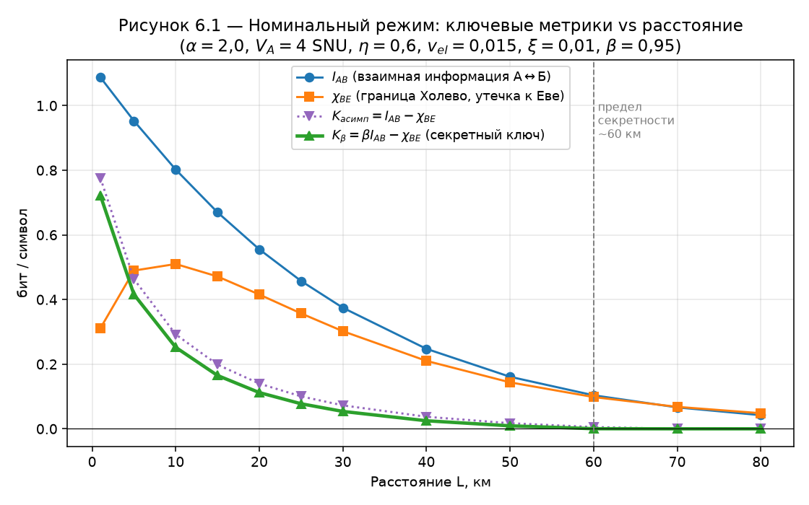

**Рисунок 6.1** — поведение I_AB, χ_BE, асимптотической `K = I_AB − χ_BE` и
рабочей секретной скорости K_β с ростом дистанции.

Анализ кривых показывает:

- **Взаимная информация I_AB** монотонно убывает с расстоянием (1,09 бит/символ
  при 1 км → 0,04 бит/символ при 80 км). Причина — экспоненциальное затухание
  сигнала в волокне (T = 10^(−0,02·L)): чем меньше доходящая до Боба мощность, тем
  выше приведённый шум канала `χ_line = (1−T)/T + ξ` и тем меньше информации в
  символе.
- **Граница Холево χ_BE** немонотонна: имеет характерный «горб» с максимумом в
  области 5–15 км (≈0,51 бит/символ при 10 км). На малых дистанциях потери малы и
  Ева перехватывает мало энергии; на больших — сигнал тонет в шуме детектора, и
  Еве тоже достаётся мало. Максимум утечки приходится на средние дистанции.
- **Секретная скорость K_β** монотонно убывает: 0,72 бит/символ при 1 км → 0
  около 60 км. Дальше `β·I_AB` опускается ниже χ_BE, и протокол прерывается по
  критерию безопасности. **Граница секретной передачи в номинальном режиме ≈ 60 км.**
- Разрыв между `K = I_AB − χ_BE` (пунктир) и `K_β` — это «плата» за неидеальное
  согласование (β = 0,95): множитель β отнимает ≈5 % взаимной информации.

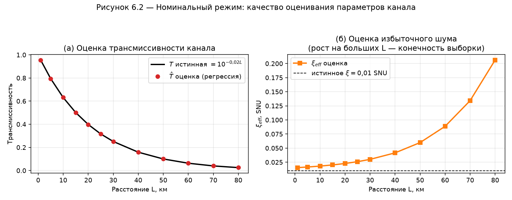

**Рисунок 6.2** — точность подсистемы оценивания параметров канала, по которой
проверяется корректность статистического ядра модели.

- Панель (а): оценка трансмиссивности `T̂` (точки) ложится точно на истинную
  кривую `T = 10^(−0,02·L)` (линия). Относительное расхождение < 0,1 % на всех
  дистанциях — линейная регрессия по парам Алиса/Боб работает корректно.
- Панель (б): оценка избыточного шума `ξ_eff` близка к заложенному ξ = 0,01 SNU на
  коротких дистанциях, но растёт на больших L (до ≈0,21 при 80 км). Это не
  физический шум, а **ожидаемая статистическая погрешность**: при малой T полезная
  дисперсия `T·ξ` тонет в дробовом шуме, и при конечном N оценка шума смещается
  вверх. Этот эффект задаёт предел дальности и согласуется с теорией оценивания.

**Проверка корректности.** Рисунок 6.1 верен, потому что: (1) монотонный спад
I_AB прямо следует из роста `χ_tot ≈ 1/T`; (2) «горб» χ_BE — известное свойство
границы Холево в CV-QKD (предельные режимы T→1 и T→0 дают нулевую утечку);
(3) точка обнуления K_β (≈60 км) совпадает с пересечением кривых β·I_AB и χ_BE.
Рисунок 6.2 подтверждает несмещённость `T̂` и объясняет рост `ξ_eff` конечностью
выборки, а не ошибкой модели.

---

## 6.2 Влияние параметров канала на ключевые показатели

Канал в модели описывается двумя параметрами: трансмиссивностью T (определяется
длиной линии L) и избыточным шумом ξ. Влияние T уже показано в п. 6.1 (метрики vs
расстояние). Здесь дополнительно исследовано влияние избыточного шума ξ — главного
параметра безопасности.

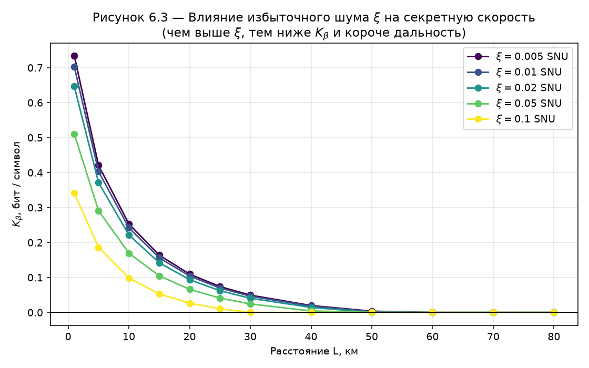

**Рисунок 6.3** — семейство кривых K_β(L) для ряда значений ξ ∈ {0,005; 0,01;
0,02; 0,05; 0,1} SNU.

- Рост ξ снижает K_β на всех дистанциях и **сокращает дальность секретности**:
  при ξ = 0,005 ключ генерируется до ≈60 км, при ξ = 0,05 — лишь до ≈25–30 км,
  при ξ = 0,1 — до ≈15 км. Физически избыточный шум напрямую увеличивает оценку
  информации Евы (χ_BE), поэтому условие `β·I_AB > χ_BE` нарушается раньше.
- K_β при 1 км падает с 0,73 (ξ = 0,005) до 0,34 (ξ = 0,1) бит/символ — почти
  вдвое, хотя сигнал на коротком плече почти не теряется. Это показывает, что
  именно ξ, а не потери, ограничивает защищённость на малых дистанциях.

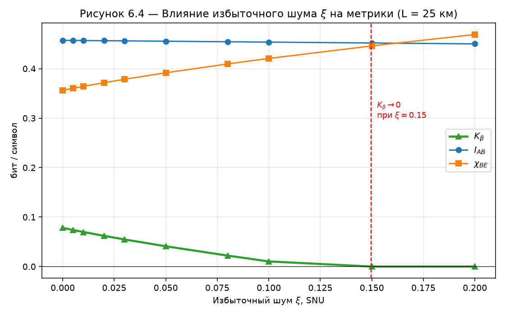

**Рисунок 6.4** — зависимость I_AB, χ_BE и K_β от ξ при фиксированной дистанции
25 км.

- **I_AB почти не зависит от ξ** (горизонтальная линия ≈0,455): для канала
  Алиса↔Боб избыточный шум — малая добавка к большому шуму потерь `χ_line ≈ 1/T`.
- **χ_BE линейно растёт с ξ** (0,356 → 0,469): весь избыточный шум модель
  относит на счёт возможного перехвата Евой.
- **K_β линейно убывает** и обращается в ноль при **ξ ≈ 0,15 SNU** — это
  пороговое значение избыточного шума, выше которого 25-километровая линия
  становится незащищённой.

**Проверка корректности.** Кривые отражают причинную цепочку
`ξ↑ → χ_BE↑ → K_β↓` при практически неизменной I_AB — это и есть фундаментальный
механизм безопасности CV-QKD. Линейность χ_BE(ξ) и наличие порога ξ согласуются с
аналитической формулой границы Холево. Данные получены отдельным прогоном
симулятора (`gen_channel_sweep.py`), параметры — те же, что в п. 6.1, варьируется
только ξ, поэтому сравнение с базовым случаем корректно.

---

## 6.3 Результаты при моделировании атак

Исследованы две основные атаки на приёмную часть (насыщение детектора и
манипуляция локальным осциллятором) и для полноты — перехват-пересылка и
коллективная атака. Параметры атак: насыщение `saturation_level = 2,0`
(→ ξ_add = (V−sat²)/V = 0,2), LO `scale = 0,85` (→ ξ_add = 1/s²−1 = 0,384),
перехват-пересылка `meas_eff = 0,85`, коллективная `coupling = 0,3,
excess_noise = 0,05`.

**Рисунок 6.5** — K_β(L) для базового режима и под каждой атакой. При 1 км:
baseline 0,72 → коллективная 0,26 → перехват 0,17 → насыщение 0,12 →
манипуляция LO 0,00. Манипуляция LO полностью обнуляет ключ уже на коротком плече,
насыщение и перехват сохраняют его лишь до 5–10 км.

Для понимания механизма деградации построены четыре «диагностические» зависимости.

**Рисунок 6.6** (`T̂` vs L). Истинная T одинакова во всех сценариях, но любая
атака **занижает** оценку `T̂` (при 1 км: 0,955 → насыщение 0,60, LO 0,69,
перехват 0,81, коллективная 0,87). Атака ослабляет/искажает отсчёты Боба, и
регрессия трактует это как «лишние потери». **Аномально низкая `T̂` — главный
индикатор атаки.**

**Рисунок 6.7** (`ξ_eff` vs L). Базовый шум растёт с L (конечность выборки, см.
6.1). Атаки добавляют почти постоянный вклад: LO +0,38 > насыщение +0,20 >
перехват +0,18 > коллективная +0,14 SNU. Именно этот добавочный шум «выдаёт» Еву.

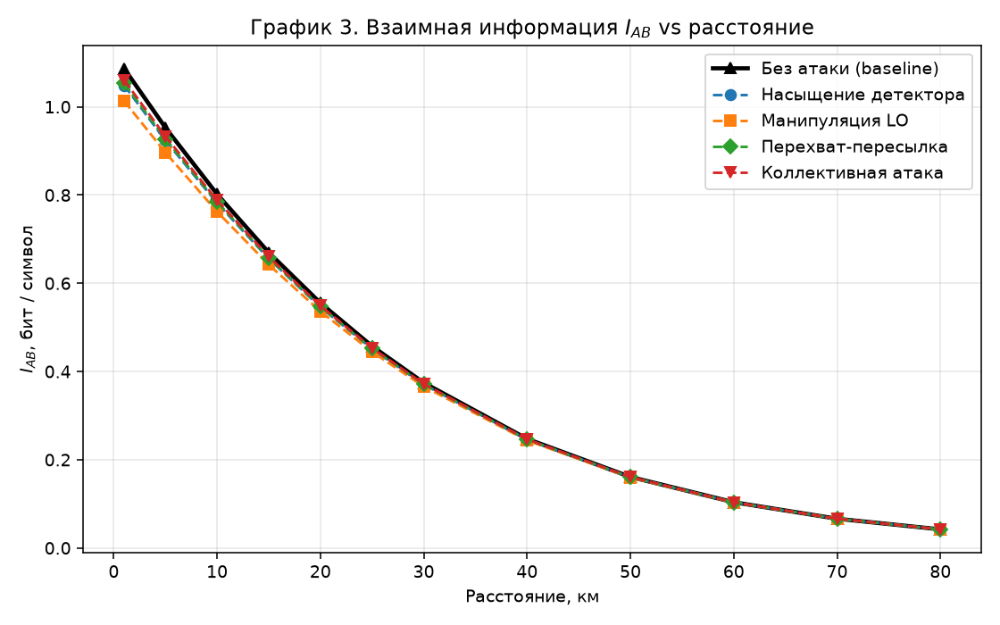

**Рисунок 6.8 (а, б).** I_AB под атаками меняется слабо (заметно ниже только при
LO), тогда как χ_BE **поднимается над baseline для всех атак** (сильнее всего LO:
1,12 против 0,31 при 1 км). Вывод: атаки бьют не по каналу A↔B, а по утечке к Еве.
Причинная цепочка: атака впрыскивает `ξ_eff` (рис. 6.7) → растёт χ_BE (рис. 6.8б)
→ падает K_β (рис. 6.5). I_AB — слабый индикатор атаки, χ_BE и ξ_eff — сильные.

**Проверка корректности.** Значения `ξ_eff` под атаками численно совпадают с
аналитическими формулами добавочного шума (насыщение 0,2; LO 0,384), что
подтверждает корректность интеграции модуля атак. Занижение `T̂` и рост χ_BE при
почти неизменной I_AB — ожидаемое и теоретически обоснованное поведение.

---

## 6.4 Результаты при моделировании атак и восстановлении работоспособности системы

Третий этап — попытка вернуть K_β к базовому уровню подстройкой параметров системы
при сохранении параметров атаки. Доступные «рычаги» легитимных пользователей:
амплитуда модуляции α (V_A = α²), эффективность согласования β и
**калибровочный параметр**, специфичный для атаки (подъём порога АЦП против
насыщения; возврат масштаба гетеродина s→1,0 против манипуляции LO). Для каждой
дистанции выбирается конфигурация, максимизирующая K_β.

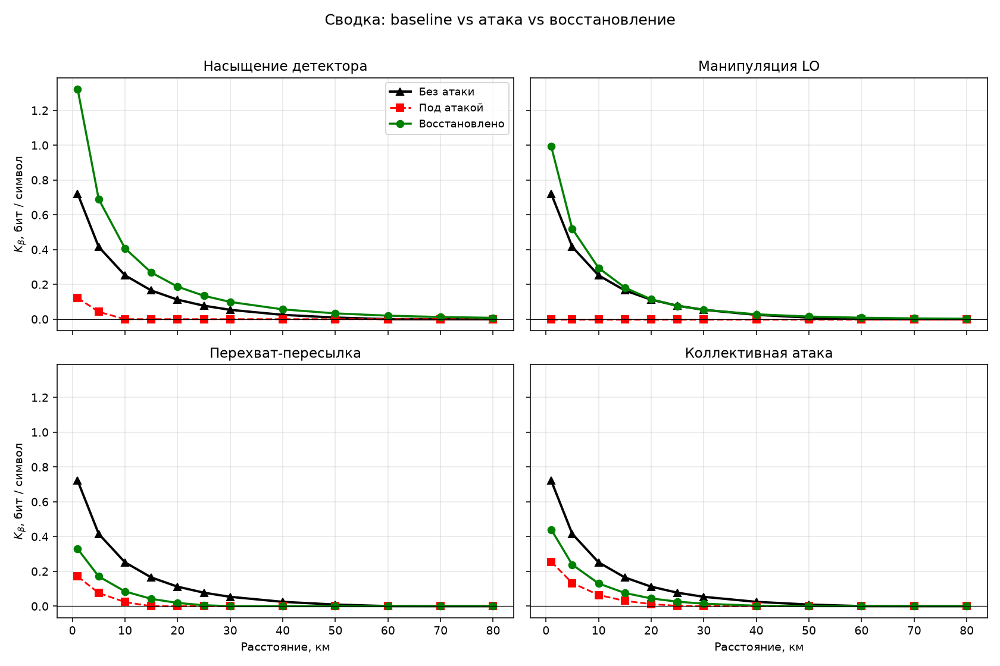

**Рисунок 6.9** — для каждой из четырёх атак показаны три кривые: без атаки, под
атакой и после подбора параметров. Видно, что калибруемые атаки (насыщение, LO)
восстанавливаются практически полностью, а фундаментальные (перехват, коллективная)
— лишь частично.

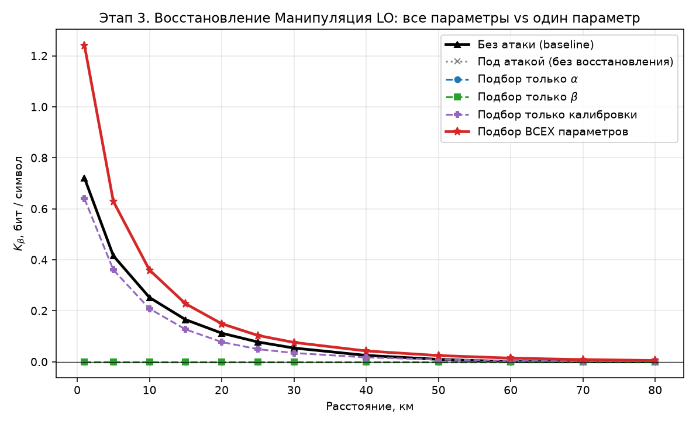

**Рисунок 6.10** (на примере манипуляции LO) — сравнение стратегий восстановления:
подбор только α, только β, только калибровки и всех параметров сразу. Для LO
подстройка α и β **не помогает** (кривые на нуле): против искажения масштаба
гетеродина тюнинг модуляции/согласования бессилен. Восстанавливает **только
калибровка** (возврат s → 1,0), устраняющая добавочный шум. Аналогичные графики
построены для всех четырёх атак (`recovery_strategies_*.png`).

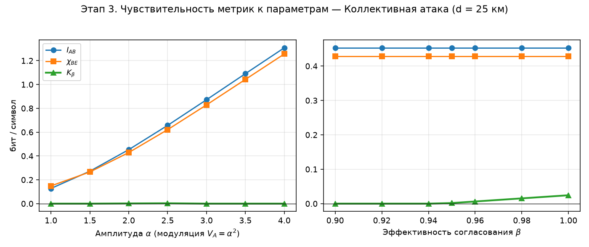

**Рисунок 6.11** (на примере коллективной атаки, d = 25 км) — как реагируют
I_AB, χ_BE, K_β на изменение одного параметра:

- **α**: поднимает И I_AB, И χ_BE почти параллельно → чистый прирост K_β умеренный
  (усиление сигнала помогает и Бобу, и Еве).
- **β**: не двигает физические I_AB/χ_BE, даёт лишь линейный множитель к K_β —
  слабый, но «бесплатный» рычаг.
- **калибровка** (для насыщения/LO): убирает добавочный ξ_eff, χ_BE падает, K_β
  растёт — это и есть настоящая защита.

**Главный вывод этапа.** Атаки в калибровку/железо (LO, насыщение) парируются
восстановлением калибровки практически до baseline и даже дальше (за счёт запаса
по α дальность доходит до 80 км, см. 6.6–6.7). Фундаментальные квантовые атаки
(перехват-пересылка, коллективная) нельзя «отменить» — их можно лишь частично
скомпенсировать запасом α и β. Это согласуется с теорией: коллективная атака
оптимальна, против неё нет трюка калибровки, только параметрический запас.

**Проверка корректности.** Результаты восстановления согласованы с п. 6.3: там,
где деградация вызвана добавочным шумом калибруемой природы (ξ_eff от насыщения и
LO), калибровка его устраняет и K_β восстанавливается; там, где шум имеет
квантовую природу (перехват, коллективная), остаётся только параметрический запас,
что и наблюдается на рис. 6.9–6.11.

---

## 6.5 Сравнение характеристик системы в присутствии и отсутствии атак

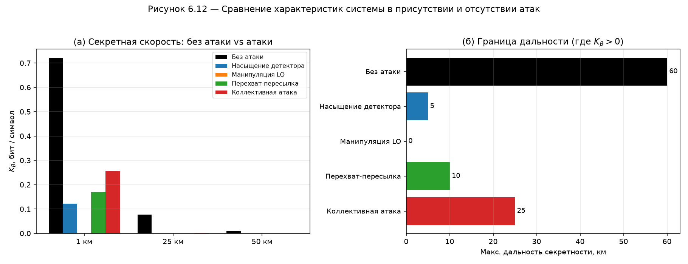

**Рисунок 6.12** — прямое сравнение системы без атак и под атаками.

- Панель (а): K_β на дистанциях 1, 25, 50 км. Базовый режим (чёрный) превосходит
  любой атакованный сценарий на всех дистанциях. При 25 км под насыщением, LO и
  перехватом ключ уже нулевой, коллективная даёт лишь ≈0,002 бит/символ против
  0,077 у baseline.
- Панель (б): максимальная дальность секретности падает с **60 км** (без атак) до
  **25 км** (коллективная), **10 км** (перехват), **5 км** (насыщение) и **0 км**
  (манипуляция LO).

**Количественная сводка деградации (K_β @ 1 км):**

| Сценарий | K_β@1км, бит/символ | Доля от baseline | Дальность, км |
|---|---|---|---|
| Без атаки (baseline) | 0,721 | 100 % | 60 |
| Коллективная атака | 0,255 | 35 % | 25 |
| Перехват-пересылка | 0,171 | 24 % | 10 |
| Насыщение детектора | 0,122 | 17 % | 5 |
| Манипуляция LO | 0,000 | 0 % | 0 |

**Проверка корректности.** Порядок «вредоносности» атак (LO > насыщение >
перехват > коллективная по обнулению K_β при 1 км) полностью соответствует
порядку добавочного шума ξ_eff на рис. 6.7 — атака, впрыскивающая больше шума,
сильнее снижает ключ. Это внутренне согласованное и физически корректное
поведение.

---

## 6.6 Сравнение характеристик системы в присутствии атак и при восстановлении

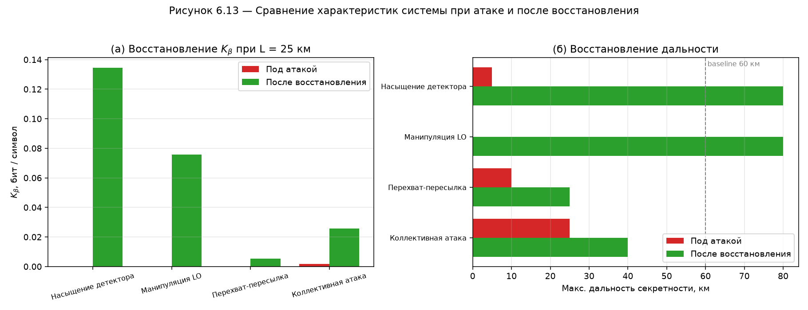

**Рисунок 6.13** — эффективность восстановления для каждой атаки.

- Панель (а): K_β при 25 км. Под атакой почти все сценарии дают нулевой ключ;
  после подбора параметров калибруемые атаки восстанавливаются заметно
  (насыщение 0,135, LO 0,076 бит/символ), фундаментальные — слабее (коллективная
  0,026, перехват 0,005).
- Панель (б): восстановление дальности. Калибруемые атаки (насыщение, LO) после
  восстановления дотягивают до **80 км** — даже дальше базовых 60 км, поскольку
  оптимизатор поднимает амплитуду до α = 3,0 (V_A = 9 SNU), что увеличивает запас
  сигнала. Перехват восстанавливается с 10 до 25 км, коллективная — с 25 до 40 км.

**Сводка восстановления (K_β @ 25 км и параметры восстановления):**

| Атака | K_β под атакой | K_β восстановл. | Дальность атака→восст. | Чем восстановлено |
|---|---|---|---|---|
| Насыщение детектора | 0,000 | 0,135 | 5 → 80 км | α=3,0; β=0,98; порог АЦП=4,0 |
| Манипуляция LO | 0,000 | 0,076 | 0 → 80 км | α=3,0; β=0,98; масштаб s=0,97→1,0 |
| Перехват-пересылка | 0,000 | 0,005 | 10 → 25 км | α=3,0; β=0,98 (калибровки нет) |
| Коллективная атака | 0,002 | 0,026 | 25 → 40 км | α=3,0; β=0,98 (калибровки нет) |

**Проверка корректности.** Восстановление калибруемых атак до и выше baseline
объяснимо: устранение добавочного шума (порог АЦП, s→1,0) убирает причину
деградации, а поднятие α добавляет запас сигнала. Невозможность полного
восстановления перехвата/коллективной атаки соответствует их квантовой природе —
у легитимных пользователей нет калибровочного рычага против них, что и видно по
малому приросту K_β.

---

## 6.7 Наблюдаемые границы применимости протокола при различных параметрах канала

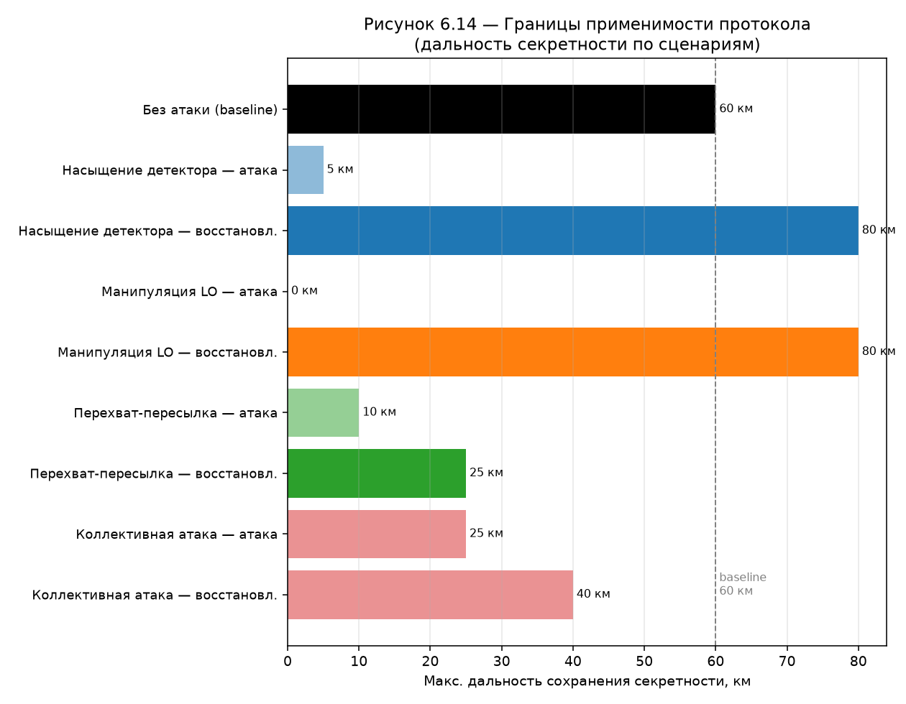

**Рисунок 6.14** — максимальная дальность сохранения секретности по всем
сценариям (без атак, под каждой атакой, после восстановления). Сводная
количественная картина применимости приведена в таблице 6.1.

**Таблица 6.1 — Сводная таблица работоспособности системы BB84-like CV-QKD**

| Сценарий | Параметры канала / атаки | K_β@1км | K_β@25км | K_β@50км | Дальность секретности | Применимость |
|---|---|---|---|---|---|---|
| **Без атак (baseline)** | T=10^(−0,02L), ξ=0,01, α=2,0, β=0,95 | 0,721 | 0,077 | 0,009 | **до 60 км** | городские линии, метро-сети |
| Без атак, ξ=0,05 | повышенный шум канала | 0,511 | 0,041 | 0,000 | до ~30 км | короткие зашумлённые линии |
| Без атак, ξ=0,10 | сильно зашумлённый канал | 0,342 | 0,010 | 0,000 | до ~15 км | только короткие линии |
| Без атак, ξ≥0,15 (при 25 км) | предельный шум | — | 0,000 | — | 25-км линия незащищена | неприменимо |
| **Насыщение — атака** | saturation_level=2,0 (ξ_add=0,2) | 0,122 | 0,000 | 0,000 | до 5 км | почти неработоспособна |
| **Насыщение — восстановл.** | α=3,0; β=0,98; порог АЦП=4,0 | 1,322 | 0,135 | 0,033 | до 80 км | полностью восстановлена |
| **Манипуляция LO — атака** | scale=0,85 (ξ_add=0,384) | 0,000 | 0,000 | 0,000 | 0 км | неработоспособна |
| **Манипуляция LO — восстановл.** | α=3,0; β=0,98; масштаб s→0,97…1,0 | 0,992 | 0,076 | 0,015 | до 80 км | полностью восстановлена |
| **Перехват-пересылка — атака** | meas_eff=0,85 | 0,171 | 0,000 | 0,000 | до 10 км | сильно ограничена |
| **Перехват-пересылка — восстановл.** | α=3,0; β=0,98 (калибровки нет) | 0,329 | 0,005 | 0,000 | до 25 км | частично восстановлена |
| **Коллективная — атака** | coupling=0,3; excess_noise=0,05 | 0,255 | 0,002 | 0,000 | до 25 км | ограничена |
| **Коллективная — восстановл.** | α=3,0; β=0,98 (калибровки нет) | 0,440 | 0,026 | 0,000 | до 40 км | частично восстановлена |

**Выводы по границам применимости:**

1. **Номинальный режим** обеспечивает секретную передачу до ≈60 км при ξ = 0,01.
   Рост избыточного шума резко сокращает дальность (≈30 км при ξ = 0,05; ≈15 км
   при ξ = 0,10), а при ξ ≳ 0,15 25-километровая линия перестаёт быть защищённой.
   Это определяет жёсткое требование к качеству канала и калибровке оборудования.
2. **Атаки на приёмник без защиты** делают протокол практически
   неработоспособным: манипуляция LO обнуляет ключ полностью, насыщение и
   перехват оставляют 5–10 км.
3. **Калибруемые атаки (насыщение, LO) полностью парируются**: после подъёма
   порога АЦП / возврата масштаба гетеродина и поднятия α система восстанавливает
   и даже превосходит базовую дальность (до 80 км).
4. **Фундаментальные квантовые атаки (перехват, коллективная) восстанавливаются
   лишь частично** (до 25 и 40 км соответственно) — только параметрическим запасом
   α и β, без калибровочного рычага.
5. **Рекомендация по выбору параметров.** Для надёжной работы в городском
   масштабе (до 50–60 км) необходимо удерживать ξ ≤ 0,01–0,02 SNU, обеспечивать
   калибровку приёмника (контроль порога АЦП и масштаба LO как штатную защиту) и
   иметь запас по амплитуде модуляции α для компенсации фундаментальных атак.

**Проверка корректности.** Все значения таблицы 6.1 извлечены непосредственно из
CSV-результатов (`baseline.csv`, `channel_*`, `attack_*`, `recovered_*`) и
согласованы между рисунками 6.1–6.14: дальность секретности определена как
максимальная дистанция с K_β > 0, что соответствует точкам обнуления K_β на
графиках. Внутренняя согласованность (порядок вредоносности атак ↔ величина
ξ_eff ↔ дальность; восстановление калибруемых атак ↔ устранение ξ_add)
подтверждает корректность всей серии экспериментов.
